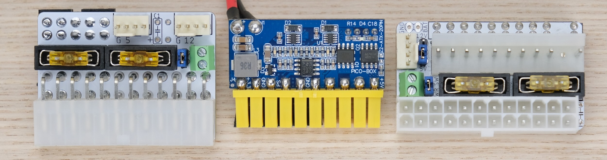

# PicoRC: PicoPSU on Retro Computers

PicoRC is a line of device-specific adaptors for using modern **Pico ATX PSU** in retro computers.

## Features

* Low cost, easy assembly and installation

* **Non-destructive** and reversible

* **PC Fan headers** for added cooling

* **Fused** outputs

* Replaces aging internal PSU that's hot, heavy, unreliable, and (slightly) explosive.

* Universal voltage

For more general-purpose diagnostics and retrofitting, check out the [full-fat ATX4VC](https://github.com/dekuNukem/ATX4VC)!

### Find your device below!

## Macintosh 128K / 512K / Plus

* [Purchase Link](https://www.tindie.com/products/28754/)

* [Instructions](og_mac.md)

## Macintosh SE / SE30

Coming soon!

(You can actually see it in the photo!)

## Apple II / II Plus / IIe / IIGS

Coming soon!

## Get in Touch

Want more? Join our official [Discord Chatroom](https://discord.gg/T9uuFudg7j) for updates.

Questions or comments? Ask in Discord, or raise a [Github issue](https://github.com/dekuNukem/ATX4VC/issues), or email `dekunukem` `gmail.com`!

