# PicoPSU Adaptor for Apple IIGS

Purchase Link(https://www.tindie.com/products/30055/) | [Official Discord](https://discord.gg/HAuuh3pAmB) | [Table of Contents](#table-of-contents)

----

This adaptor lets you use **Pico ATX PSU** in Apple IIGS computer.

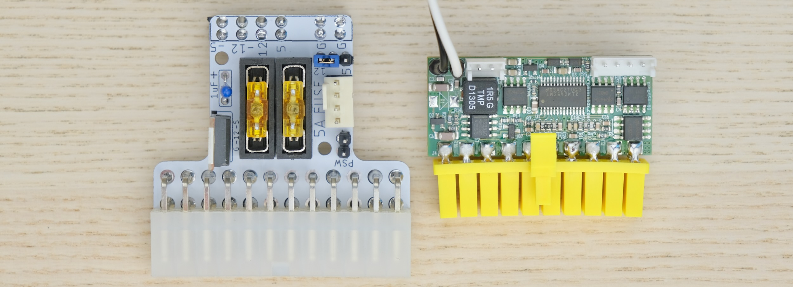

It replaces the original PSU, and uses very common **12V power brick** instead.

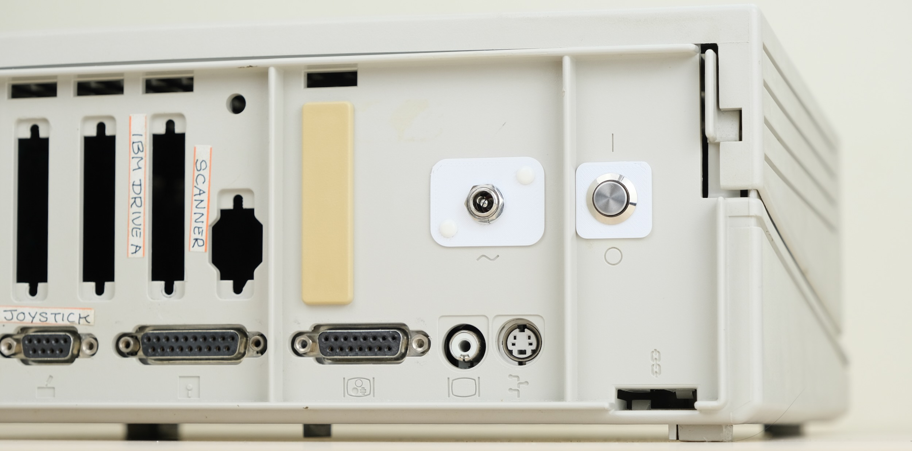

## Highlights

* **Non-destructive** and reversible

* **PC fan header** for added cooling

* **Fused** rails

* Low cost, efficient and reliable.

## Get One / Other Stuff

[Click me to get one!](https://www.tindie.com/products/30055/)

Also available for [**Mac 128K, Mac SE, Apple II, Osborne 1, and more!**](./README.md)

For more general-purpose diagnostics and retrofitting, check out the [full-fat ATX4VC](https://github.com/dekuNukem/ATX4VC)!

## Table of Contents

[Under Construction!]

## Getting a Pico PSU

PicoPSU are tiny ATX power supplies for small PCs, but are perfect for retro computers as well.

* [Official website](https://www.mini-box.com/DC-DC) and [distributors](https://www.mini-box.com/site/resellers.html). Even the cheapest 80W one should be plenty.

* You can also find generic ones on eBay/Amazon/Aliexpress by searching `Pico ATX`. They are *not that* cheap, so I strongly suggest supporting the high-quality official products.

* A power brick with **12V DC** and **center positive** 5.5x2.5mm barrel jack is needed.

* They are very popular and you might already have one. Make sure it has enough wattage.

Remember that this solution is **only as good as your PicoPSU and 12V Brick**, so don't skimp on them!

## Kit Assembly

**DON'T START YET!!!** Keep reading :)

### Required tools

* Soldering Iron

* Solder

* Flux

* Multimeter

### Parts

Observe the parts:

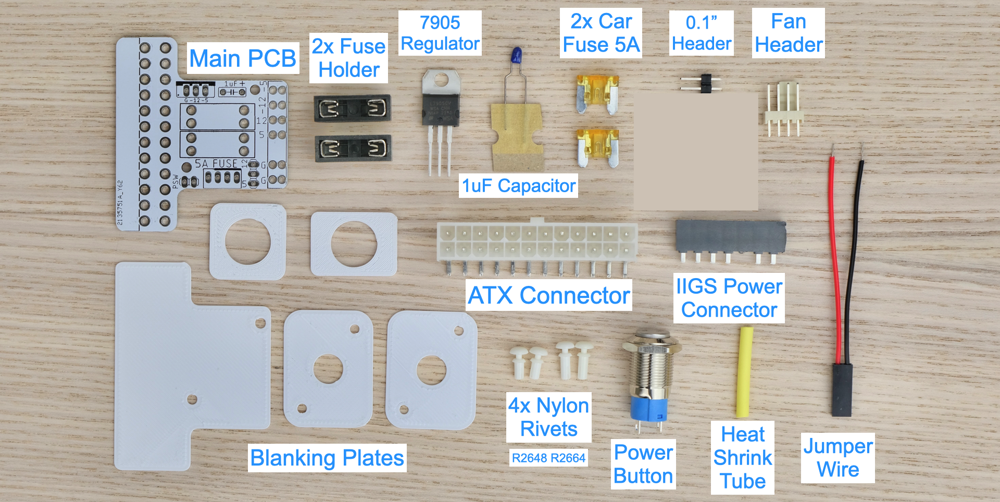

### Soldering Notes

Nothing too tricky in this kit, all basic through-hole stuff.

If this is your first time, a few tips:

* Make sure your soldering iron has **proper temperature control**, NOT the cheap ones with just a power switch! They get way too hot and will damage the PCB.

* Use **leaded solder**. Temperature around 320C / 600F

* Use plenty of flux to make things easier. You can clean it off afterwards.

* [This video](https://www.youtube.com/watch?v=AqvHogekDI4) covers the basics pretty well, you can also watch others by searching `how to solder`.

* Try your local makerspace or university lab too!

* Start from shortest to tallest. Solder **a single pin** first, check if part is straight.

### Assembly

Solder the main PCB **as shown below**, follow the notes:

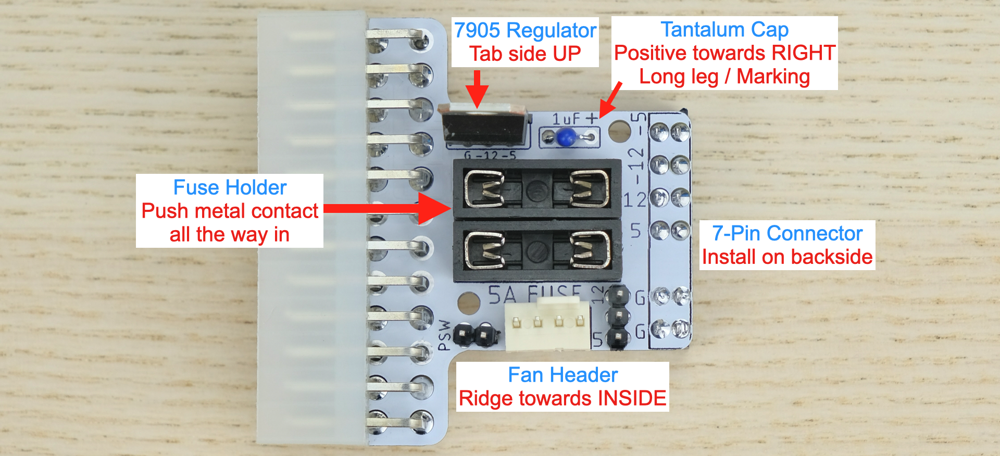

More reference photos:

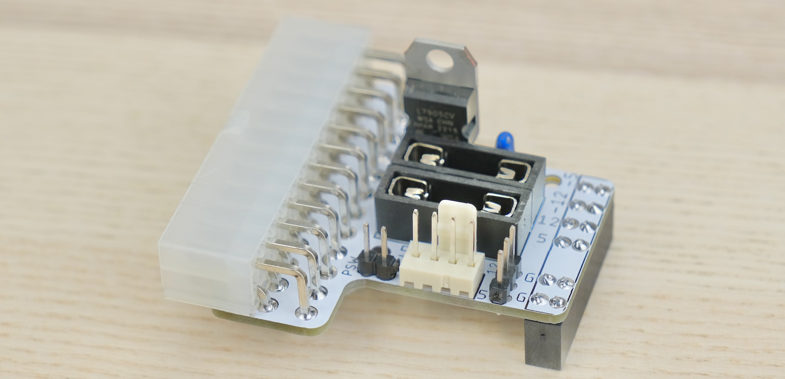

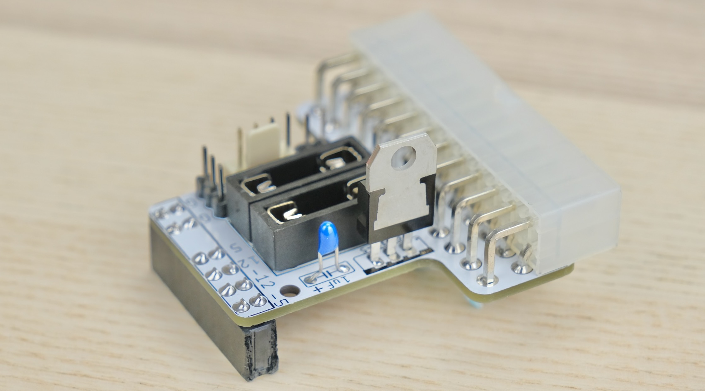

### Cleaning

This is optional, but I like to clean off the flux with 90%+ isopropyl alcohol.

Submerge and scrub with a toothbrush.

Make sure it is **completely dry** before proceeding.

### Inspection

* Compare with the reference photo and notes above. Make sure everything is in correct orientation.

* Solder joints should be **shiny and smooth**. If you see spikes, put on more flux and melt it again.

* There must be **no solder bridges**. If any, put on flux and melt it to remove.

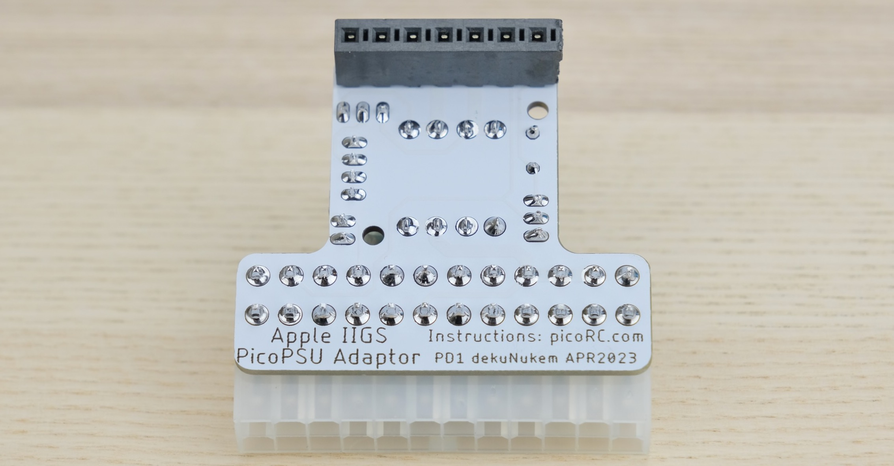

### Power Button

Slide heat shrink tubing over each jumper wire.

Solder the wires to the button.

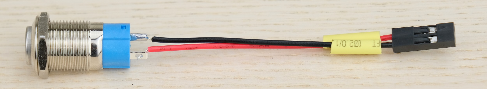

Slide the tubing up to cover the contacts. Use hot air to shrink.

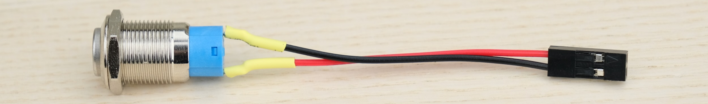

## Board Features

Install **two fuses** and the **jumper block** as shown below.

### PC Fan Header

* Any standard 3 or 4-pin PC fan should work

* Run it at 12V (full speed) or 5V (quieter) by changing the jumper

### Fuse

* Use common car fuse rated **5A OR LESS**

* **DO NOT BYPASS FUSES**

## Pre-flight Checks

Use a multimeter to **check for dead shorts** between each power pin and GND:

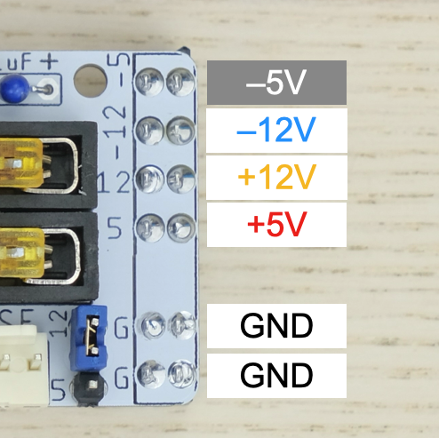

If all good, plug in PicoPSU and connect the power button, turn it on.

**Measure the voltage on each rail** and confirm they are within spec.

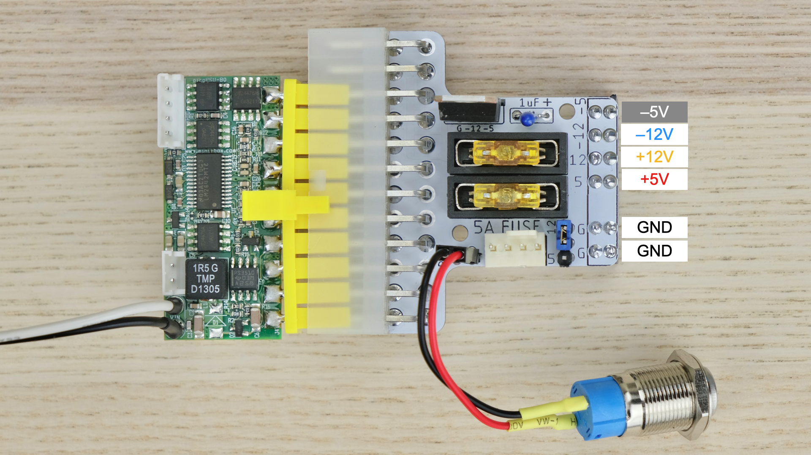

## PCB Backplate

This is to prevent short circuit on nearby components.

There should be four nylon rivets. Use the **two longer ones** for this.

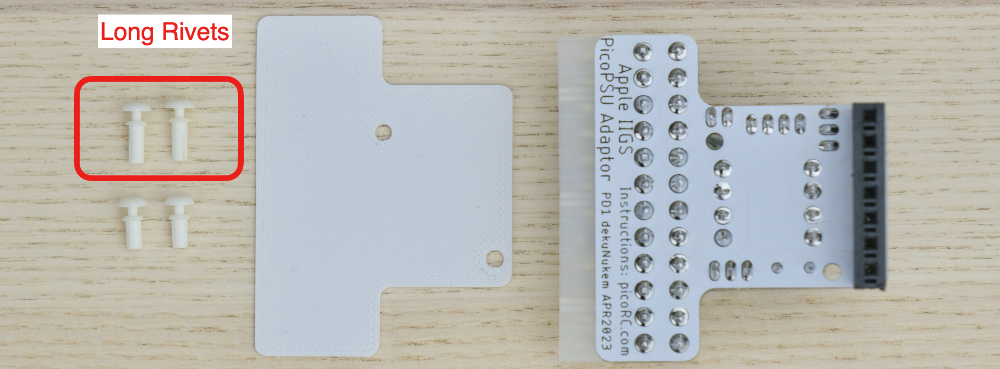

Pull them apart, insert the hollow tube from the back, then insert the plunger to fix it in place.

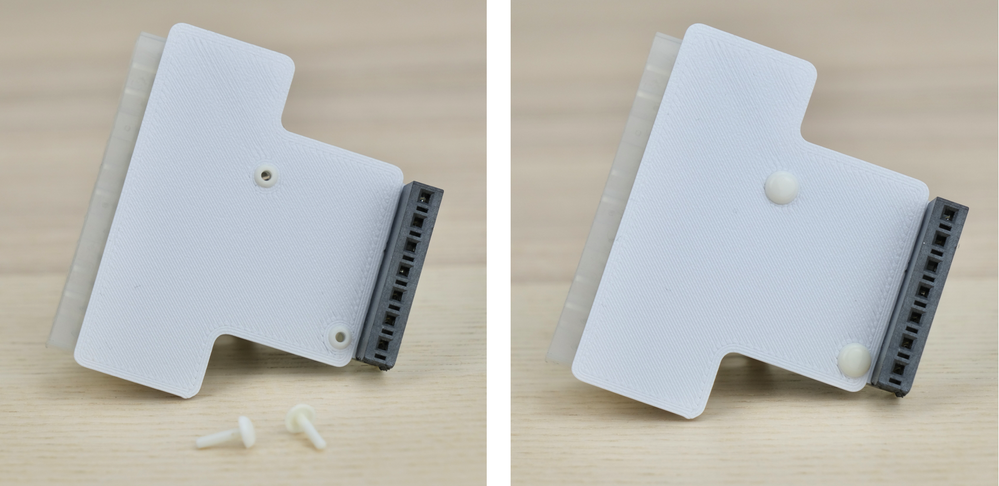

## Installation

* Remove top cover

* Pull back the tab to release old PSU

* Unplug cable

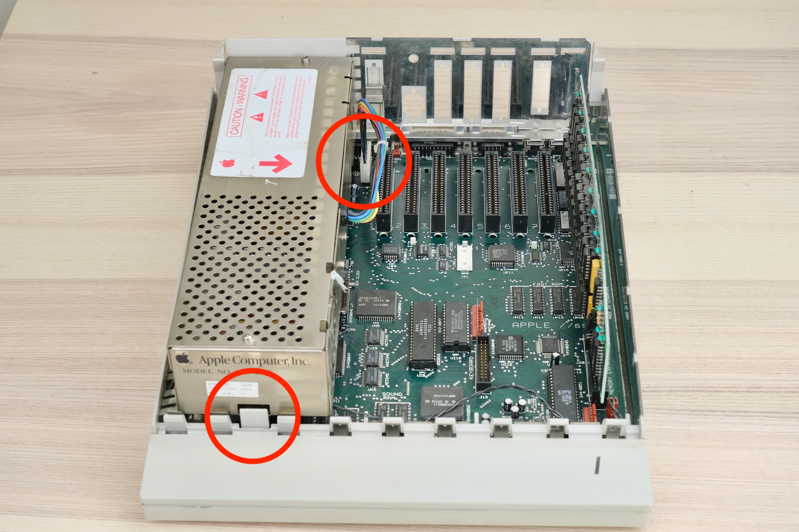

* Get the power jack plates, place one inside.

* Pull apart the rivets like last time

* Insert the hollow tube on the outside plate

* Line up and make sure it goes through both plates

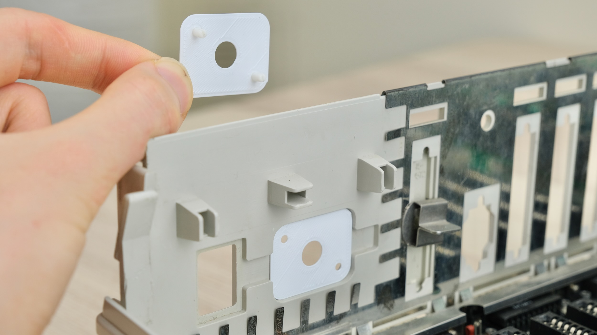

* Support the other side with your hand

* Insert the plunger to hold it in place.

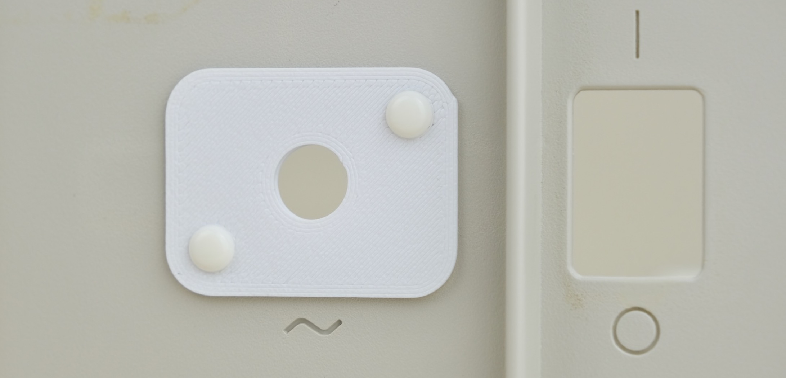

* Next up, power button.

* Gather all the parts. Undo the locking ring.

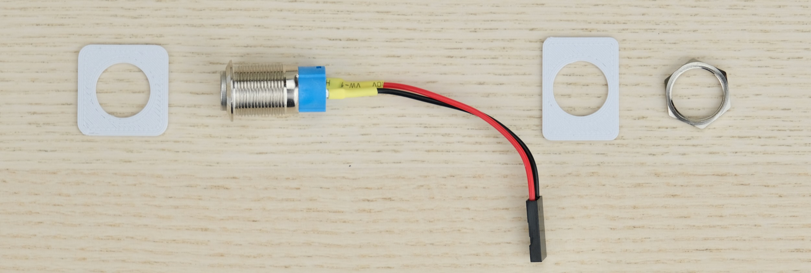

* From outside, insert the button through the square plate.

* From inside, install the rectangle plate, then tighten with the locking ring.

* Then just plug the whole thing into the power connector!

* It should go in firmly, but NOT reach the bottom.

* Plug in the power button.

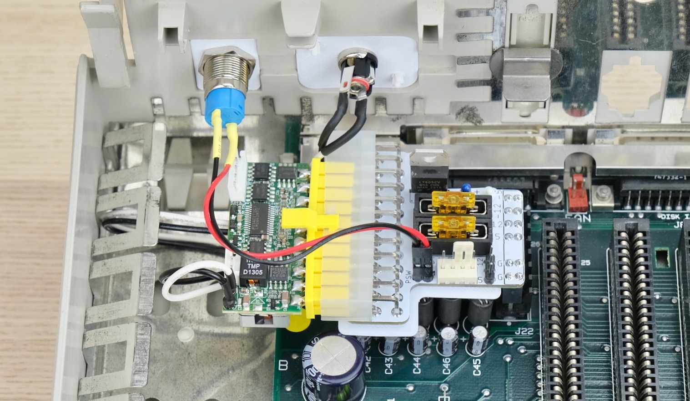

* Double check **on both sides** that **pins are lined up** and **NOT off-by-one!**

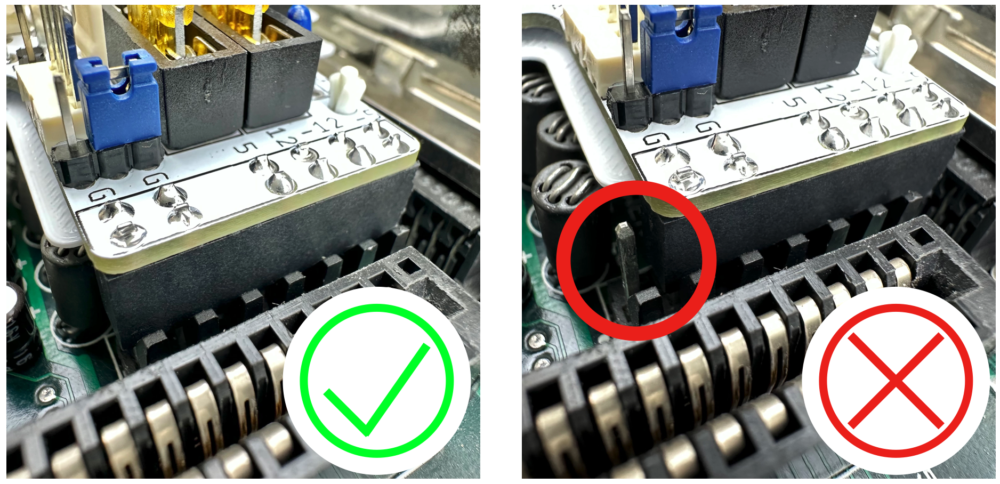

* Undo the locking ring on the barrel jack, insert through hole, reinstall on the outside.

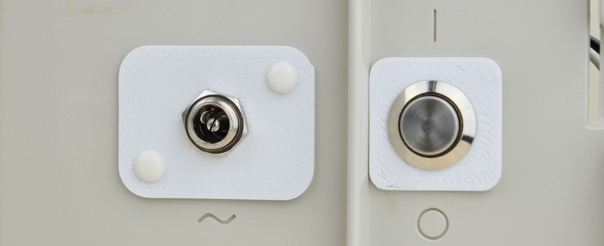

That's pretty much it!

### Adding a Fan

You can add a fan for additional cooling.

Any regular PC fan should work, you can run it at 12V (full speed) or 5V (quieter).

Make sure the fan is secured, nothing touches the blade, and air flow direction is correct.

## Congratulations!

Put the cover back on, and you're done!

With new PSU and upgraded cooling, your IIGS should continue to provide entertainment for years to come!

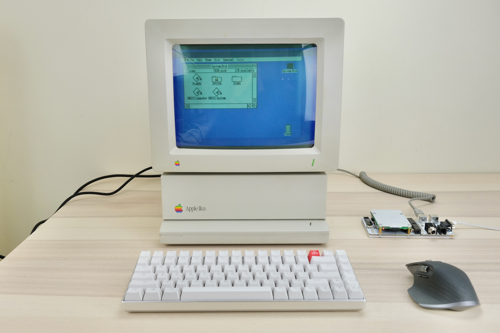

What's with the wireless keyboard and mouse? [Check out USB4VC!](https://github.com/dekuNukem/USB4VC/blob/master/README.md)

## Questions or Comments?

Feel free to ask in official [Discord Chatroom](https://discord.gg/T9uuFudg7j), raise a [Github issue](https://github.com/dekuNukem/PicoRC/issues), or email `dekunukem` `gmail.com`!
