# PicoPSU Adaptor for Apple II / II Plus / IIe

[Purchase Link](https://www.tindie.com/products/29185/) | [Official Discord](https://discord.gg/HAuuh3pAmB) | [Table of Contents](#table-of-contents)

----

This adaptor lets you use **Pico ATX PSU** in Apple II, II Plus, IIe, and IIGS-in-IIe-case.

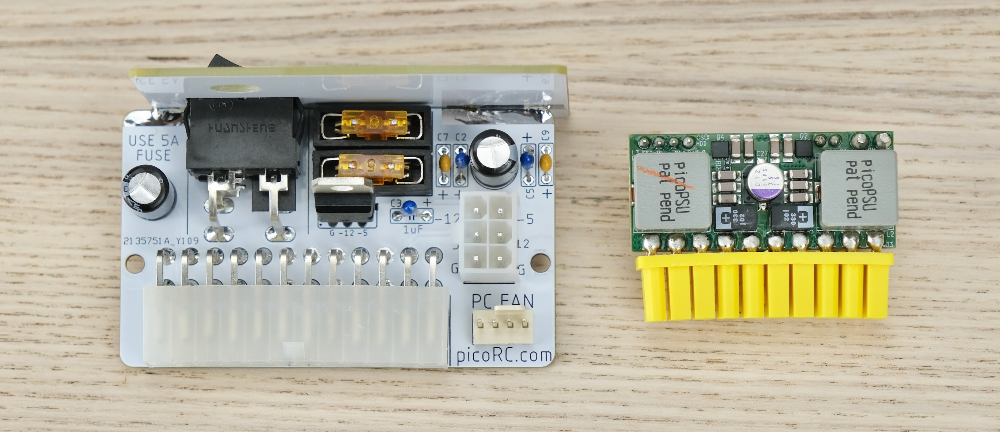

It replaces the old PSU, and uses very common 12V power brick instead.

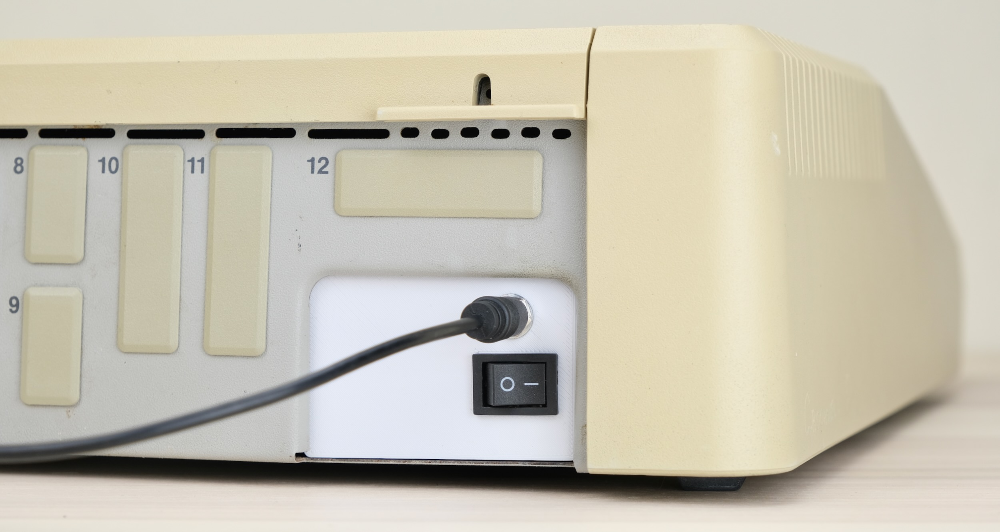

## Highlights

* **Non-destructive** and reversible

* **PC fan header**

* Universal voltage with fused rails

* Low cost, efficient and reliable.

## Get One / Other Stuff

[Click me to get one!](https://www.tindie.com/products/29185/)

Also available for [Compact Macintosh, Apple IIGS, BBC Micro, Osborne 1, and more!](./README.md)

For more general-purpose diagnostics and retrofitting, check out the [full-fat ATX4VC](https://github.com/dekuNukem/ATX4VC)!

## Table of Contents

- [Getting a Pico PSU](#getting-a-pico-psu)

- [Kit Assembly](#kit-assembly)

- [Pre-flight Checks](#pre-flight-checks)

- [Installation](#installation)

- [Questions or Comments?](#questions-or-comments)

## Getting a Pico PSU

PicoPSU are tiny ATX power supplies for small PCs, but are perfect for retro computers as well.

* [Official website](https://www.mini-box.com/DC-DC) and [distributors](https://www.mini-box.com/site/resellers.html). Even the cheapest 80W one should be plenty.

* Avoid generic clones. They over-rate and are of low quality.

* A power brick with **12V DC** and **center positive** 5.5x2.5mm barrel jack is needed.

* They are very popular and you might already have one. Make sure it has enough wattage.

Remember that this solution is **only as good as your PicoPSU and 12V Brick**, so don't skimp on them!

## Kit Assembly

**DON'T START YET!!!** Keep reading :)

Observe the parts:

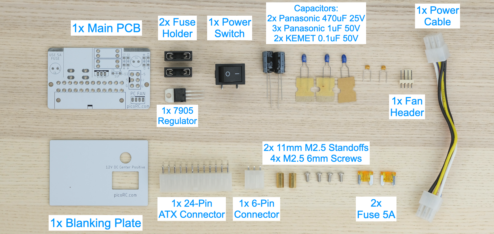

### Soldering Notes

Nothing too tricky in this kit, all basic through-hole stuff.

If this is your first time, a few tips:

* Make sure your soldering iron has **proper temperature control**. Try your local makerspace or university lab.

* Use **leaded solder** and plenty of flux, temperature around 320C / 600F.

* [This video](https://www.youtube.com/watch?v=AqvHogekDI4) covers the basics pretty well.

* Start from shortest to tallest. Solder **a single pin** first, and make sure the part is straight.

### Assembly

First, push the switch into the blanking plate as shown. Put it aside.

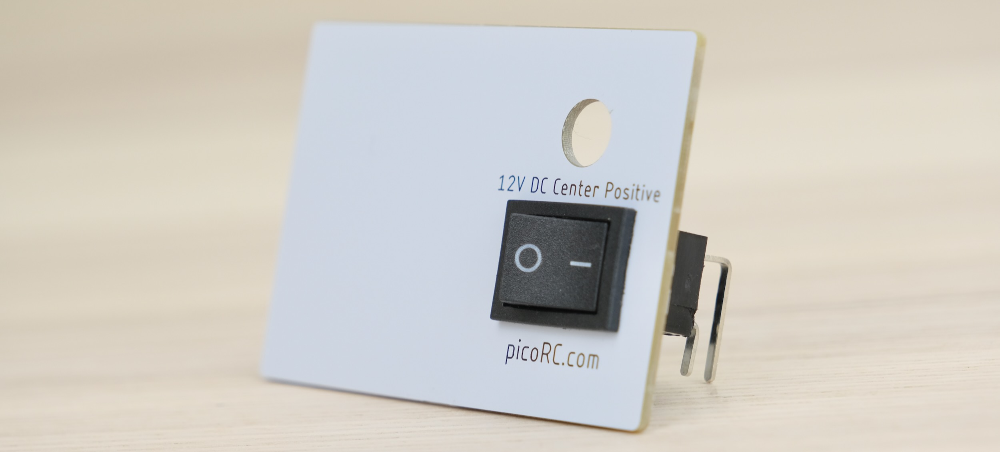

Solder the main PCB **as shown below**, follow the notes:

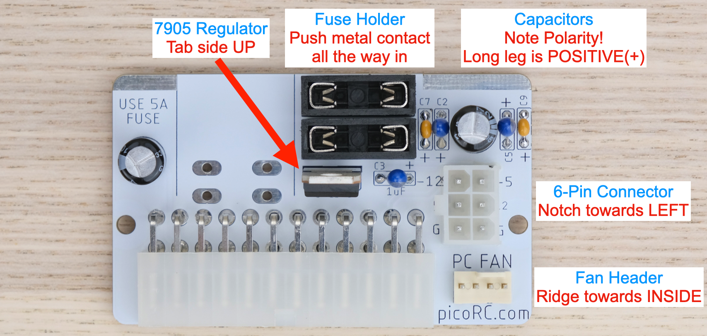

* Double check capacitor polarity!

* Black electrolytic caps: White stripe is **NEGATIVE**.

* Blue Tantalum caps: White stripe is **POSITIVE**.

* Yellow ceramic caps: No polarity.

--------

Offer up the switch assembly.

Make sure the switch sits flat. Adjust the two PCB so they are **right angle**.

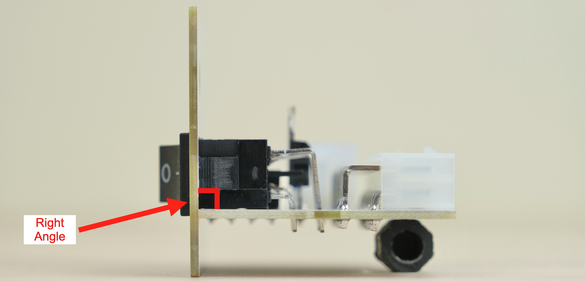

Solder the switch in place.

Also solder the two PCB together at the seam **on both sides** for rigidity. Use plenty of solder and flux.

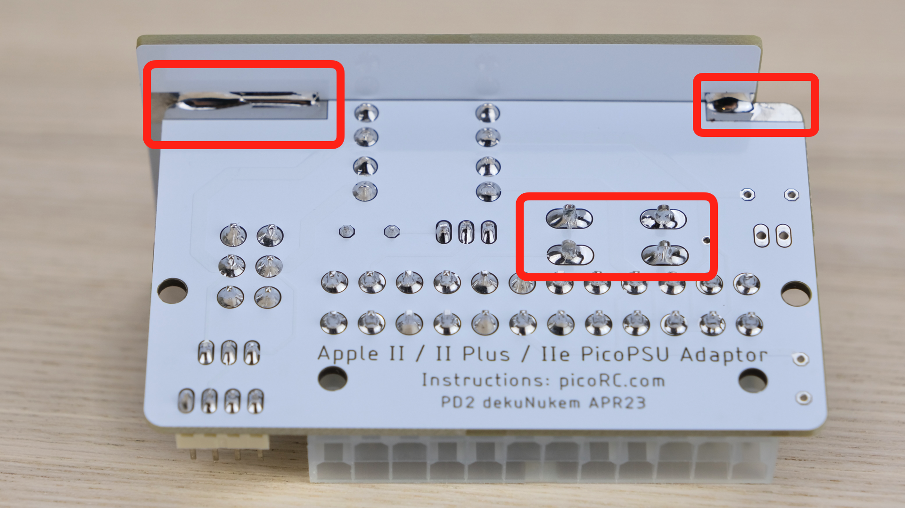

### Cleaning

This is optional, but I like to clean off the flux with 90%+ isopropyl alcohol. Submerge and scrub with a toothbrush.

Make sure it is **completely dry** before proceeding.

### Inspection

* Compare with the reference photo and notes above. Make sure everything is in correct orientation.

* Solder joints should be **shiny and smooth**. If you see spikes, put on more flux and melt it again.

* There must be **no solder bridges**. If any, put on flux and melt it to remove.

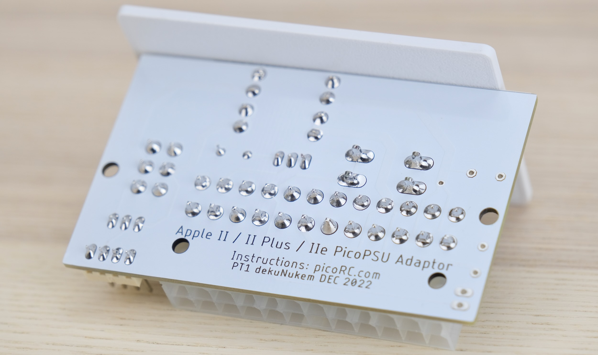

## Board Features

Install **two fuses** as shown below.

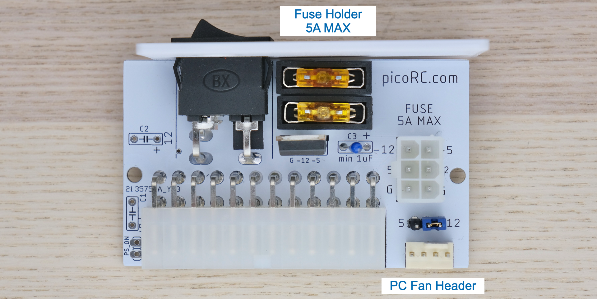

### PC Fan Header

* Any standard PC fan should work

### Fuse

* Use common automotive fuse RATED **5A OR LESS**

* **DO NOT BYPASS FUSES**

## Pre-flight Checks

Use a multimeter to **check for dead shorts** between each power pin and GND:

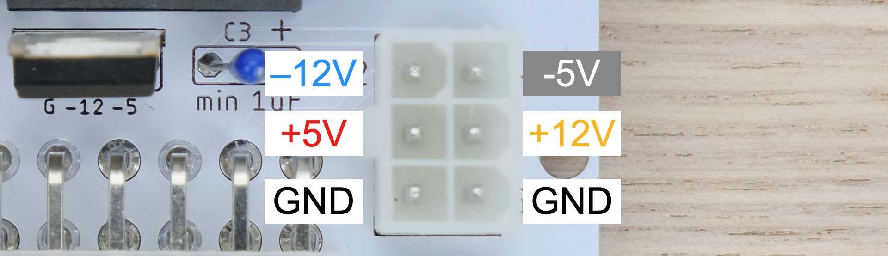

If all good, plug in Pico ATX PSU, then 12V power, and flip the switch.

The PSU should turn on. **Measure the voltage on each rail** and confirm they are within spec.

## Installation

* Remove top cover

* Pinch the connector from the side and unplug from motherboard

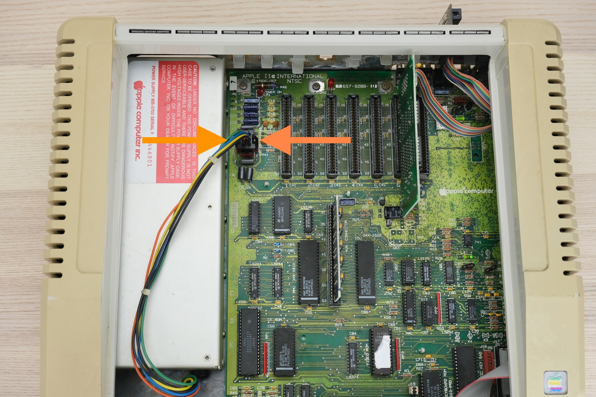

* Use a soft towel, put the machine on its side.

* Undo the 4 screws holding the PSU.

* Use your hand to support the PSU so it doesn't slam down.

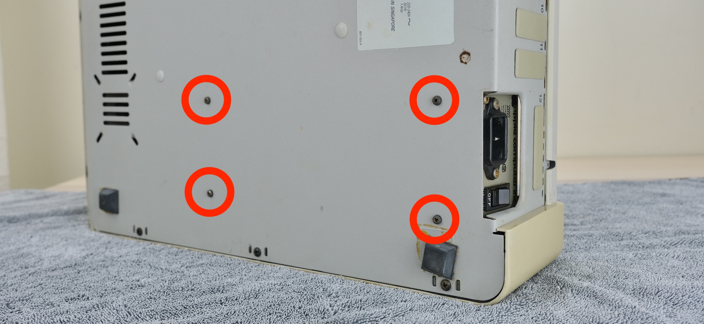

* Remove the PSU

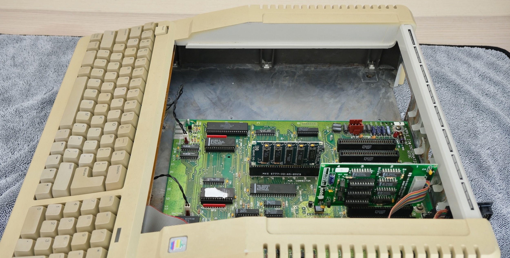

* Insert two screws into the mounting holes closest to the edge

* Install and tighten standoffs on the other side, use 5mm socket bits.

* Plug PicoPSU into the adaptor

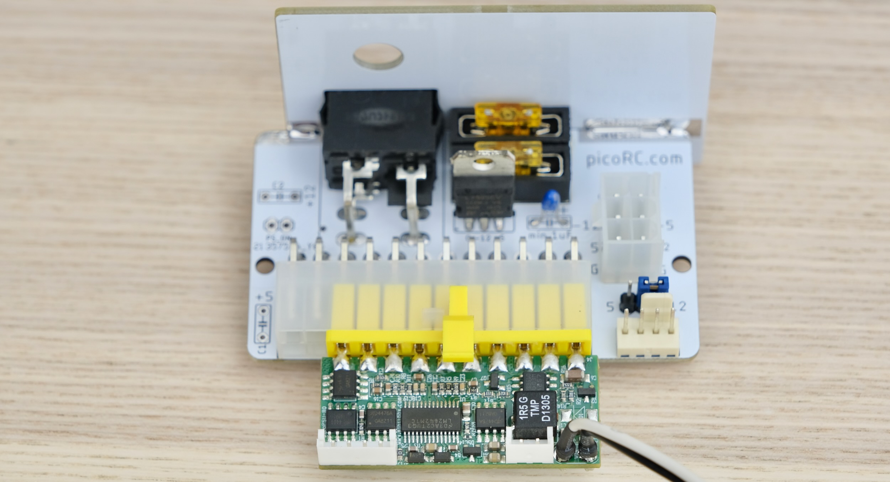

* Undo the locking ring, insert through the hole, reinstall the ring to fix it in place.

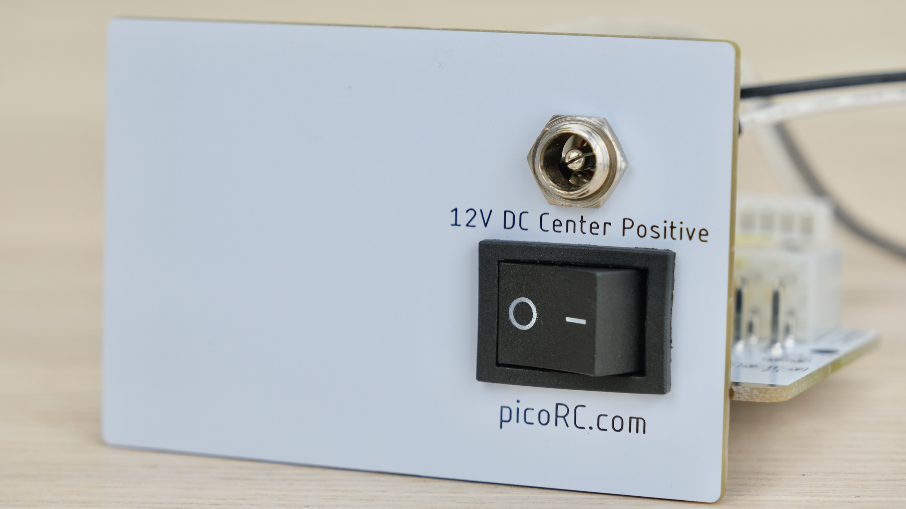

* Install the whole assembly, secure with screws.

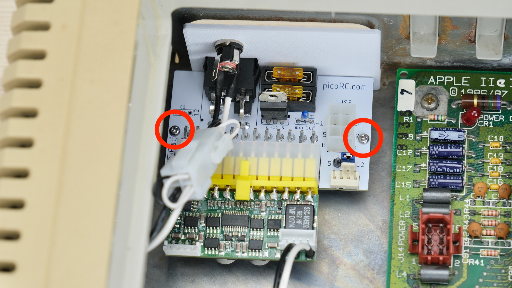

* Connect the power cable

* If using new cable, make sure the **LATCH FACES LEFT** on **BOTH ENDS**.

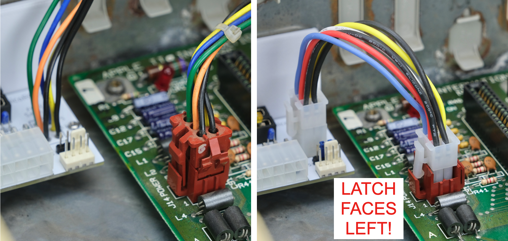

That's pretty much it, we're done!

### Adding a Fan

You can add a fan for additional cooling. Any regular PC fan should work.

Make sure the fan is secured, nothing touches the blade, and air flow direction is correct.

## Congratulations!

Put the cover back on, and you're done!

With the new PSU and upgraded cooling, your Apple II should continue to provide entertainment for years to come!

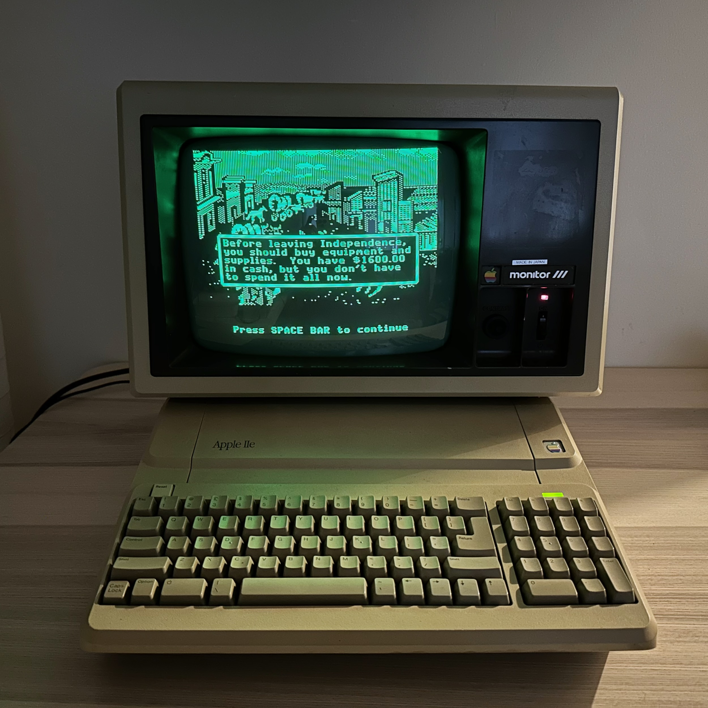

## Questions or Comments?

Feel free to ask in official [Discord Chatroom](https://discord.gg/T9uuFudg7j), raise a [Github issue](https://github.com/dekuNukem/PicoRC/issues), or email `dekunukem` `gmail.com`!
