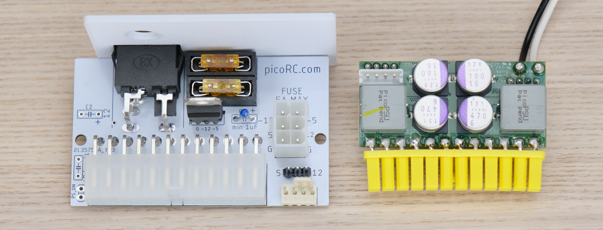
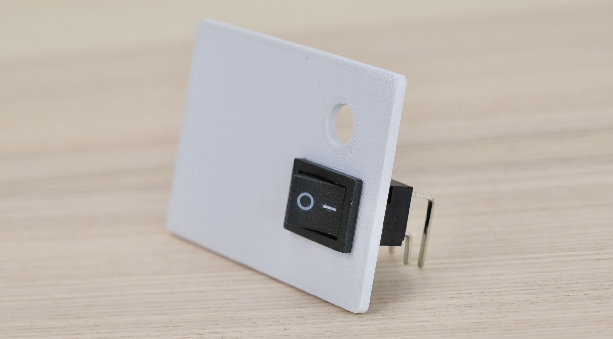
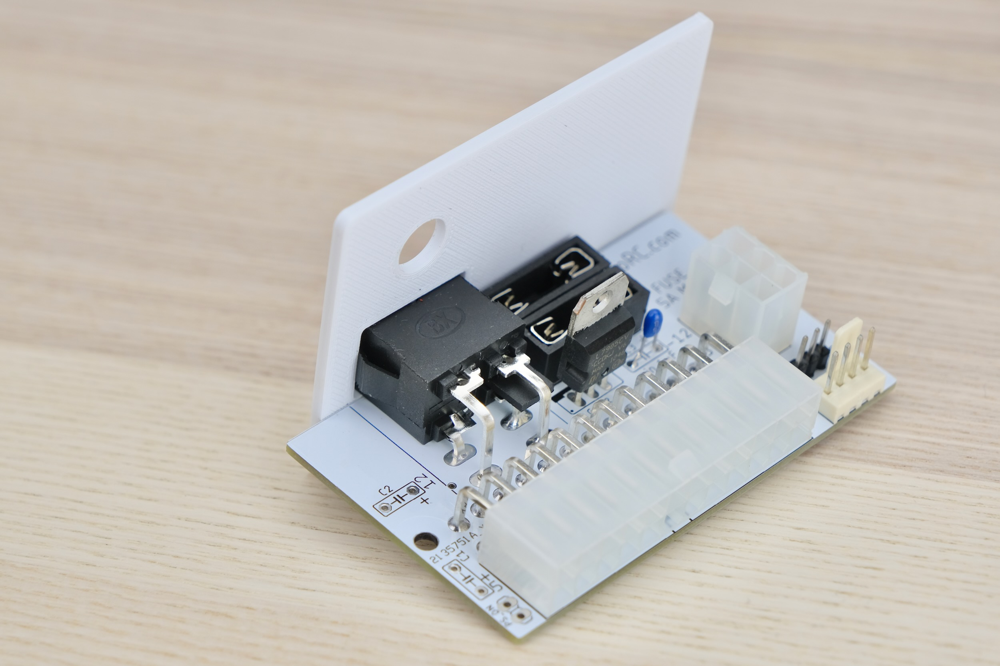
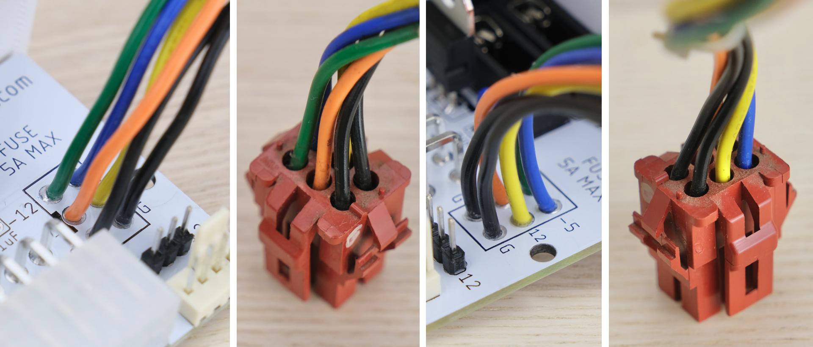
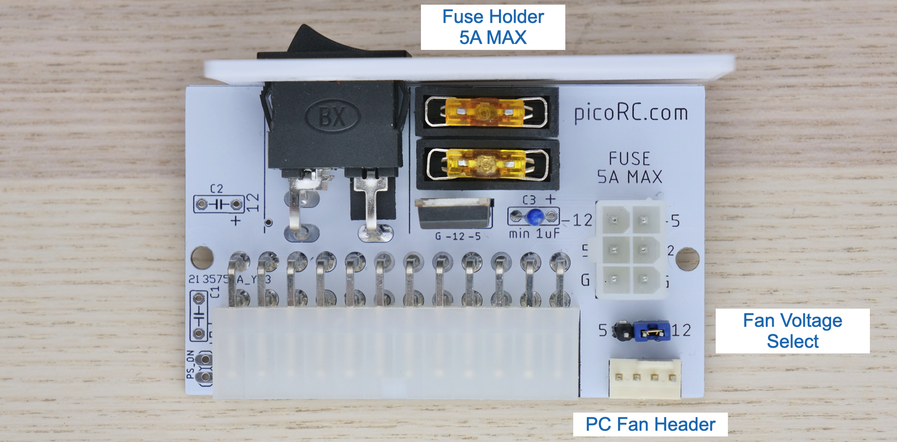
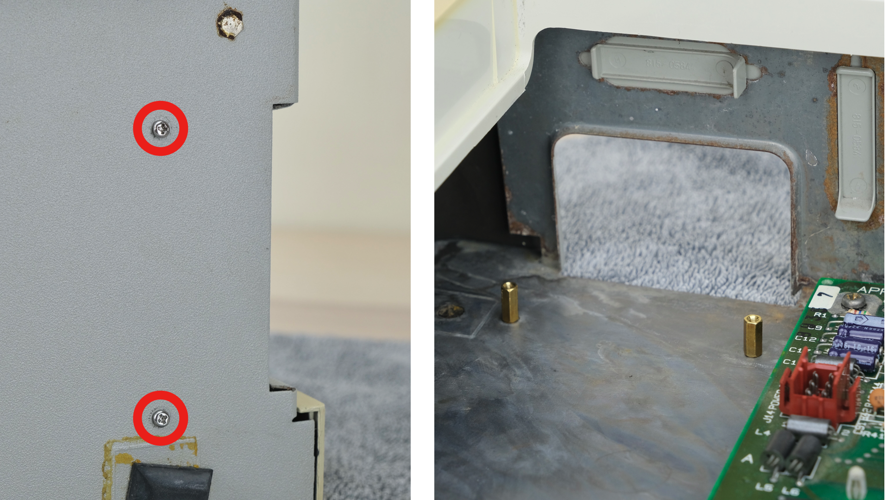
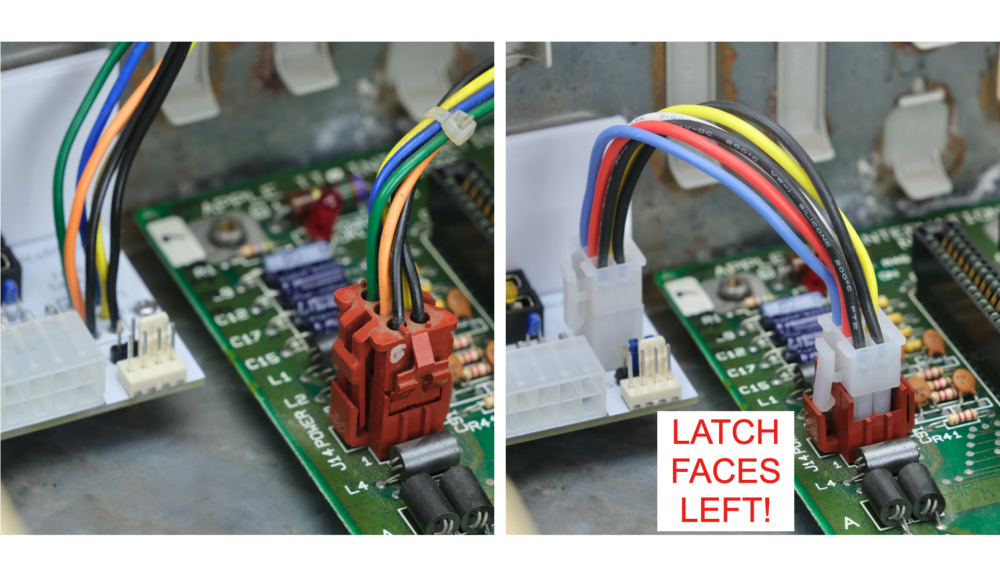

# PicoPSU Adaptor for Apple II / II Plus / IIe

[Purchase Link](https://www.tindie.com/products/29185/) | [Official Discord](https://discord.gg/HAuuh3pAmB) | [Table of Contents](#table-of-contents)

----

This adaptor lets you use **Pico ATX PSU** in Apple II, II Plus, IIe, and IIGS-in-IIe-case.

It replaces the original bulky and unreliable PSU, and uses very common 12V power brick instead.

## Highlights

* **Non-destructive** and reversible

* **PC fan header** for added cooling

* **Fused** positive rails

* Low cost, efficient and reliable.

## Get One / Other Stuff

[Click me to get one!](https://www.tindie.com/products/29185/)

Also available for Mac 128K / Plus, Mac SE, and more! [Check out the main page](./README.md) for details.

For more general-purpose diagnostics and retrofitting, check out the [full-fat ATX4VC](https://github.com/dekuNukem/ATX4VC)!

## Table of Contents

- [Highlights](#highlights)

- [Get One / Other Stuff](#get-one---other-stuff)

- [Getting a Pico PSU](#getting-a-pico-psu)

- [Kit Assembly](#kit-assembly)

- [Board Features](#board-features)

- [Pre-flight Checks](#pre-flight-checks)

- [Installation](#installation)

- [Congratulations!](#congratulations)

- [Questions or Comments?](#questions-or-comments)

## Getting a Pico PSU

PicoPSU are tiny ATX power supplies for small PCs, but are perfect for retro computers as well.

* [Official website](https://www.mini-box.com/DC-DC) and [distributors](https://www.mini-box.com/site/resellers.html). Even the cheapest 80W one should be plenty.

* You can also find generic ones on eBay/Amazon/Aliexpress by searching `Pico ATX`. They are *not that* cheap, so I strongly suggest supporting the high-quality official products.

* A power brick with **12V DC** and **center positive** 5.5x2.5mm barrel jack is needed.

* They are very popular and you might already have one. Make sure it has enough wattage.

Remember that this solution is **only as good as your PicoPSU and 12V Brick**, so don't skimp on them!

## Kit Assembly

### Required tools

* Soldering Iron

* Solder

* Flux

* Multimeter

### Parts

Observe the parts:

### Soldering Notes

Nothing too tricky in this kit, all basic through-hole stuff.

If this is your first time, a few tips:

* Make sure your soldering iron has **proper temperature control**, NOT the cheap ones with just a power switch! They get way too hot and will damage the PCB.

* Use **leaded solder**, much easier to work with.

* Set the temperature around 320C / 600F

* Use plenty of flux, makes everything much easier. You can clean it off afterwards.

* [This video](https://www.youtube.com/watch?v=AqvHogekDI4) covers the basics pretty well, you can also watch others by searching `how to solder`.

* Try your local makerspace or university lab too!

### Wiring Harness

You have a choice about motherboard power cable.

You can either:

* Cut the wires off old PSU and solder them to the adaptor

* Or use a new 6-pin connector and cable

First choice retains the original connector which has a perfect fit.

Second choice keeps the old PSU intact, but new connector is slightly different.

You can also [buy a new connector](https://www.digikey.co.uk/en/products/detail/te-connectivity-amp-connectors/1-640520-0/187722) and [contacts](https://www.digikey.co.uk/en/products/detail/te-connectivity-amp-connectors/641294-1/289717) here.

Anyway, make a choice, both work just fine.

### Assembly

First, push the switch into the blanking plate.

* Make sure the **openings are to the right side**, **hole is on top**, **switch pins points down**.

Observe the following assembly notes and reference photos.

If re-using the harness, make sure the wires are arranged **exactly the same way as the connector**.

Two black wires on the bottom, all other colors in the same order.

Start from shortest component to tallest. Insert component, hold in place with masking tape or sticky putty.

Flip it over and solder **a single pin** first, then make sure the part is **straight in all directions**.

If not, you can adjust it while melting that single pin. Once happy, solder the rest of the pins.

Make sure the solder melts properly and wets both the pin and pad to prevent cold solder joints, especially on thicker power pins.

### Cleaning

This is optional, but I like to clean off the flux with 90%+ isopropyl alcohol. Submerge and scrub with a toothbrush.

Make sure it is **completely dry** before proceeding.

### Inspection

* Compare with the reference photo and notes above. Make sure everything is in correct orientation.

* Solder joints should be **shiny and smooth**. If you see spikes, put on more flux and melt it again.

* There must be **no solder bridges**. If any, put on flux and melt it to remove.

## Board Features

Install **two fuses** and the **jumper block** as shown below.

### PC Fan Header

* Any standard 3 or 4-pin PC fan should work

* Run it at 5V or 12V by changing the jumper

* 12V is full speed, 5V is much quieter.

### Fuse

* Use common car fuse RATED **5A OR LESS**

* Regular, Mini, and low-profile Mini all will work. Simply push into the holder.

* **DO NOT BYPASS FUSES**

### Filtering Cap (Optional)

* You can add a filtering cap to +5V and +12V rails, note the polarity if using electrolytic caps.

## Pre-flight Checks

Use a multimeter to **check for dead shorts** between each power pin and GND:

If re-using harness:

If all good, plug in Pico ATX PSU, then 12V power, and flip the switch.

The PSU should turn on, **measure the voltage on each rail** and confirm they are within spec.

If using existing harness, make sure the voltage readings matches the photo exactly. Otherwise you might have wired it up wrong. 

## Installation

* Remove top cover

* Pinch the connector from the side and unplug from motherboard

* Use a soft towel, put the machine on its side.

* Undo the 4 screws holding the PSU.

* Use your hand to support the PSU so it doesn't slam down.

* Remove the PSU

* Insert two screws into the mounting holes closest to the edge

* Install and tighten standoffs on the other side

* Your screwdriver set might have a bit that fits the standoff, makes it much easier.

* Plug PicoPSU into the adaptor

* Undo the locking ring on the barrel jack, insert through the hole, reinstall the ring to fix it in place.

* Install the whole assembly, secure with screws.

* Plug in the connector.

* If using new cable, make sure the **LATCH FACES LEFT** on **BOTH ENDS**.

That's pretty much it, we're done!

### Adding a Fan

You can add a fan for additional cooling.

Any regular PC fan should work, you can run it at 12V (full speed) or 5V (quieter).

Make sure the fan is secured, nothing touches the blade, and air flow direction is correct.

## Congratulations!

Put the cover back on, and you're done!

With the new PSU and upgraded cooling, your Apple II should continue to provide entertainment for years to come!

## Questions or Comments?

Feel free to ask in official [Discord Chatroom](https://discord.gg/T9uuFudg7j), raise a [Github issue](https://github.com/dekuNukem/PicoRC/issues), or email `dekunukem` `gmail.com`!
