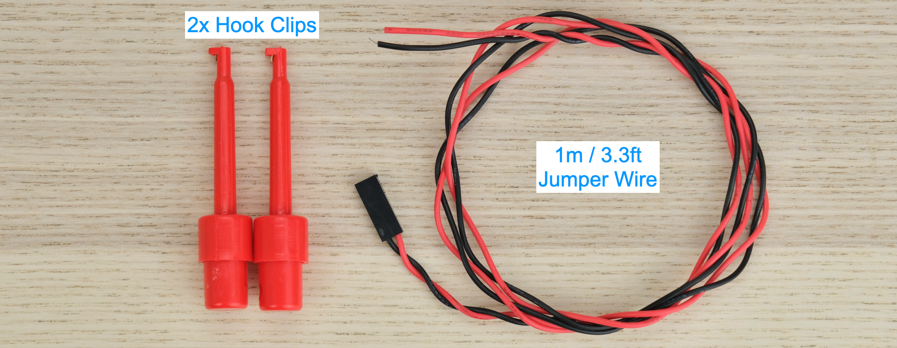
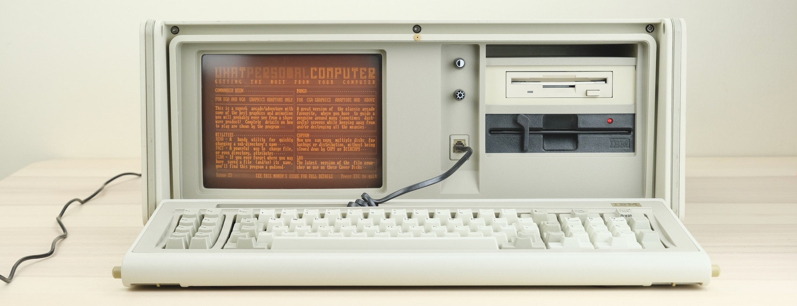

# PicoPSU Adaptor for IBM Portable Personal Computer 5155

[Purchase Link](https://www.tindie.com/products/31437) | [Official Discord](https://discord.gg/HAuuh3pAmB) | [Table of Contents](#table-of-contents)

----

This adaptor lets you use **Pico ATX PSU** on IBM Portable Personal Computer 5155. 

The PSU-in-a-Card replaces the original PSU, and uses very common **12V power brick** instead.

## Features

* **Non-destructive**

* **PC fan** header

* Built-in power switch

* Also supports the Big Red Switch™

## Get One / Other Stuff

[Click me to get one!](https://www.tindie.com/products/31437)

Also available for [**Regular PC, Compact Macintosh, Apple II/IIGS, Osborne 1, Apricot PC, BBC Micro, and more!**](./README.md)

For more general-purpose diagnostics and retrofitting, check out the [full-fat ATX4VC](https://github.com/dekuNukem/ATX4VC)!

## Table of Contents

- [Getting a Pico PSU](#getting-a-pico-psu)

- [Kit Assembly](#kit-assembly)

- [Pre-flight Checks](#pre-flight-checks)

- [Installation](#installation)

- [External Power Switch](#external-power-switch)

- [IBM 5155 Instructions](#ibm-5155-instructions)

- [Questions or Comments?](#questions-or-comments)

## Getting a Pico PSU

PicoPSUs are tiny ATX power supplies for small PCs, but are perfect for retro computers as well.

* [Official website](https://www.mini-box.com/DC-DC) and [distributors](https://www.mini-box.com/site/resellers.html).

* The cheapest **80W** one should be plenty for the **floppy-only** model.

* The **160W** variant is recommended if using many expansion cards and/or the **spinning hard drive**.

* Avoid generic clones. They over-rate and are of low quality.

* A **12V DC** power brick with **center positive** 5.5x2.5mm barrel jack is needed.

* They are very popular and you might already have one. Make sure it has enough wattage.

## Kit Assembly

**DON'T START YET!!!** Keep reading :)

Observe the parts:

### Soldering Notes

Nothing too tricky in this kit, all basic through-hole stuff.

If this is your first time, a few tips:

* Make sure your soldering iron has **proper temperature control**. Try your local makerspace or university lab.

* Use **leaded solder** and plenty of flux, temperature around 320C / 600F.

* [This video](https://www.youtube.com/watch?v=AqvHogekDI4) covers the basics pretty well.

### Assembly

Solder the components **as shown below**:

* Double check capacitor polarity!

* Black electrolytic caps: White stripe is **NEGATIVE**.

* Blue Tantalum caps: White stripe is **POSITIVE**.

* Yellow ceramic caps: No polarity.

### Cleaning

This is optional, but I like to clean off the flux with 90%+ isopropyl alcohol.

Submerge and scrub with a toothbrush.

Make sure it is **completely dry** before proceeding.

### Inspection

* Compare with the photo and notes above. Make sure everything is in correct orientation.

* Solder joints should be **shiny and smooth**. If you see spikes, put on more flux and melt it again.

* There must be **no solder bridges**. If any, put on flux and melt it to remove.

### Bracket

Install the metal bracket.

The shorter side should be touching the PCB.

Secure with M3 screws from the bottom.

Then install the ISA bracket, secure with two more M3 screws.

## Pre-flight Checks

Install two 5A fuses.

Use a multimeter to **check for dead shorts** between each power rail and GND:

If all good, plug in PicoPSU, and flip the switch.

The LED should light up. The LED is wired to the `POWER_GOOD` signal, so there might be a slight delay.

Measure the voltage of each rail, make sure they are correct. 

## Installation

Undo the locking ring on the barrel jack.

Insert through the hole on the bracket.

Tighten the ring from the other side. Use 10mm socket.

Insert the power cables into the terminal blades.

* Match the colours! (RED: 5V | ORANGE: PowerGood | BLACK: GND)

* Ensure the connectors are **all the way in**.

* Ensure the **insulating sleeves** are in place.

Now we're ready to install!

**⚠️⚠️ Insert the blanking plug into the power socket. ⚠️⚠️**

This prevents the old faulty/unknown PSU from being accidentally energized.

(1) Unlatch the keyboard.

(2) Release, unplug, and remove the keyboard.

Undo six screws on the face plate.

Slide the outer case backwards to remove.

Undo three screws and remove the RF cage.

Unplug the floppy cable and all power connectors to free up some space.

Plug the adaptor into an ISA slot.

The outmost one is recommended.

Secure with screw.

Insert a flat-blade screwdriver into the blade receptacle.

Expand the gap slightly so it goes in easier.

Now take a look at the AT-style connector.

We just need to insert the cables into the appropriate pins.

Other rails will be fed through the ISA bus.

Let's start with the **RED** 5V cable.

Any will do, but I suggest the rightmost pin, easier to remember.

Push **straight down**, make sure **lobe side faces outwards**.

Don't force if there is significant resistance, make the gap bigger and try again.

On the other hand, it shouldn't be too loose either.

Repeat with the other two wires.

**BLACK** GND wire can be any of the four pins in the middle.

**ORANGE** PG wire is on the other end.

Make sure they are **all the way in**, and covered with **insulation sleeve**.

Double check the connection:

Plug in the CRT power cable.

Double check that the **purple wire faces left (12V)**.

Put the machine on its face, undo the two screws for the cable cage.

Feed the CRT power cable through the opening.

Unplug the connector labelled P12, might be tight, be gentle and take your time.

Plug in the new power connector. **Make sure the color match!**

Reinstall the cable cage.

## Moment of Truth

Now we can power on and find out if it works!

If the 5155 is of unknown condition, it is **highly recommended** to **start minimal** with just the motherboard and video card. Remove all extra cards and disconnect the drives.

Plug in and flip the switch!

If it works, congrats! You can now add more parts back in and reassemble.

If nothing happens, the tantalum capacitors the +12V and -12V line are often the culprit, you can simply remove them. [More info here](https://minuszerodegrees.net/5150_5160/MDC/tantalum_short_plus_12volts.htm).

--------

For drives, use the harness that came with the PicoPSU.

## But I Want to Use the Big Red Switch™!

under construction

## Questions or Comments?

Feel free to ask in official [Discord Chatroom](https://discord.gg/T9uuFudg7j), raise a [Github issue](https://github.com/dekuNukem/PicoRC/issues), or email `dekunukem` `gmail.com`!
