# PicoPSU Adaptor for IBM PC Compatibles

[Purchase Link] | [Official Discord](https://discord.gg/HAuuh3pAmB) | [Table of Contents](#table-of-contents)

----

# UNDER CONSTRUCTION !!!!!!!!!!!!!!!!!!234567890-=

This adaptor lets you use **Pico ATX PSU** on IBM PC, XT, AT, and compatible clones.

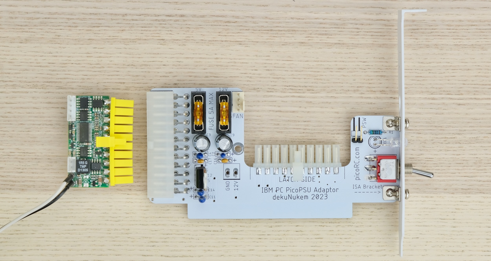

This PSU-in-a-Card replaces the original PSU, and uses very common **12V power brick** instead.

## Features

* **Non-destructive** and reversible

* Onboard **-5V regulator**

* **PC fan** header

* Built-in power switch, also supports external switch.

## Get One / Other Stuff

[Click me to get one!]

Also available for [**Mac 128K, Mac SE, Apple II/IIGS, Osborne 1, Apricot PC, BBC Micro, and more!**](./README.md)

For more general-purpose diagnostics and retrofitting, check out the [full-fat ATX4VC](https://github.com/dekuNukem/ATX4VC)!

## Table of Contents

- [Getting a Pico PSU](#getting-a-pico-psu)

- [Kit Assembly](#kit-assembly)

- [Pre-flight Checks](#pre-flight-checks)

- [Installation](#installation)

- [Questions or Comments?](#questions-or-comments)

## Getting a Pico PSU

PicoPSUs are tiny ATX power supplies for small PCs, but are perfect for retro computers as well.

* [Official website](https://www.mini-box.com/DC-DC) and [distributors](https://www.mini-box.com/site/resellers.html).

* The 120W variant should be plenty for PC or XT **without** spinning hard drives.

* The 160W variant is recommended for later machines, or if using spinning hard drives.

* Avoid generic clones. They over-rate and are of low quality.

* A power brick with **12V DC** and **center positive** 5.5x2.5mm barrel jack is needed.

* They are very popular and you might already have one. Make sure it has enough wattage.

Remember that this solution is **only as good as your PicoPSU and 12V Brick**, so don't skimp on them!

## Kit Assembly

**DON'T START YET!!!** Keep reading :)

Observe the parts:

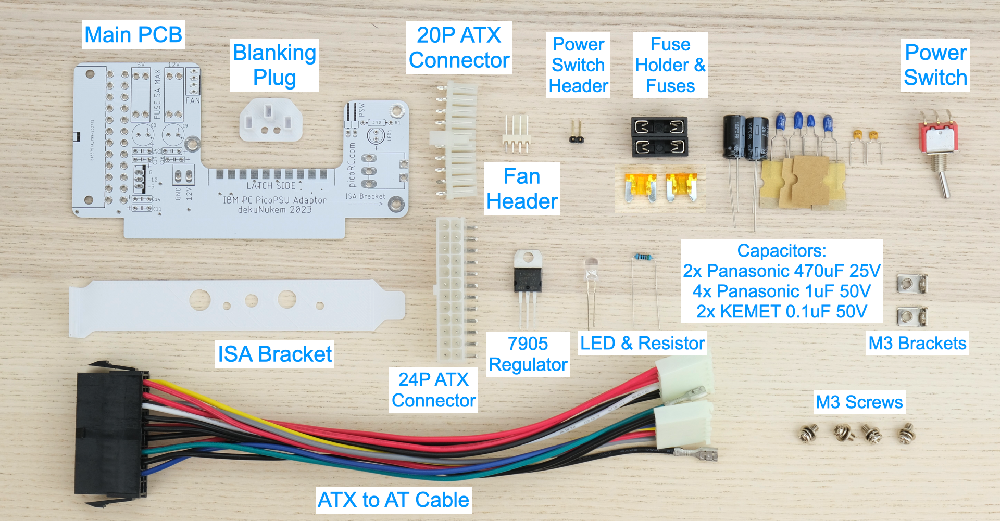

### Soldering Notes

Nothing too tricky in this kit, all basic through-hole stuff.

If this is your first time, a few tips:

* Make sure your soldering iron has **proper temperature control**. Try your local makerspace or university lab.

* Use **leaded solder** and plenty of flux, temperature around 320C / 600F.

* [This video](https://www.youtube.com/watch?v=AqvHogekDI4) covers the basics pretty well.

### Assembly

Use something flat and rigid (credit card, guitar picks, etc), widen the gaps on the 20P ATX connector slightly.

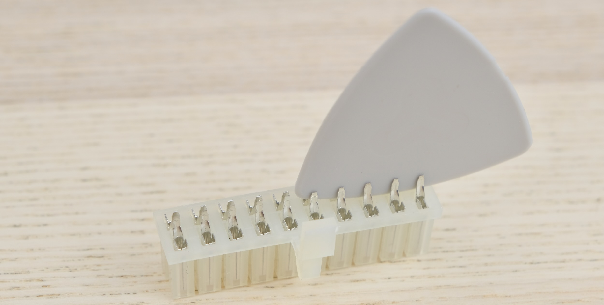

Install the 20P connector on the PCB.

* Latch facing up (see photo)

* Make sure everything is in a straight line, not curled.

* Pins are within the pads

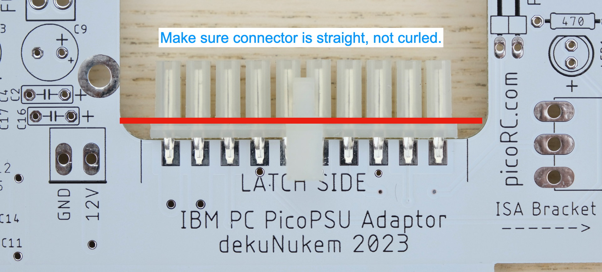

Solder the components **as shown below**:

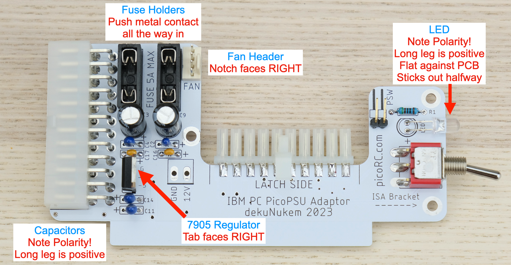

* Double check capacitor polarity!

* Black electrolytic caps: White stripe is **NEGATIVE**.

* Blue Tantalum caps: White stripe is **POSITIVE**.

* Yellow ceramic caps: No polarity.

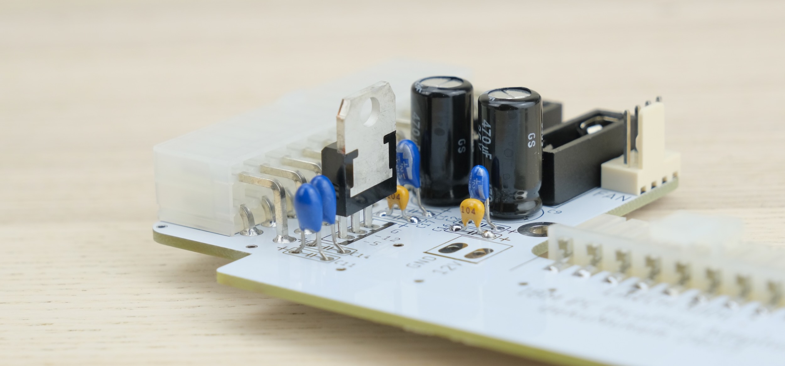

### Cleaning

This is optional, but I like to clean off the flux with 90%+ isopropyl alcohol.

Submerge and scrub with a toothbrush.

Make sure it is **completely dry** before proceeding.

### Inspection

* Compare with the reference photos and notes above. Make sure everything is in correct orientation.

* Solder joints should be **shiny and smooth**. If you see spikes, put on more flux and melt it again.

* There must be **no solder bridges**. If any, put on flux and melt it to remove.

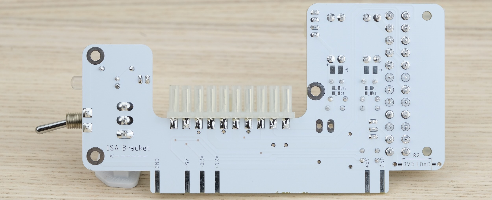

### Bracket

Install the metal bracket on the PCB, secure with M3 screws from the bottom.

The shorter side should be touching the PCB.

Then install the ISA bracket, secure with two more M3 screws.

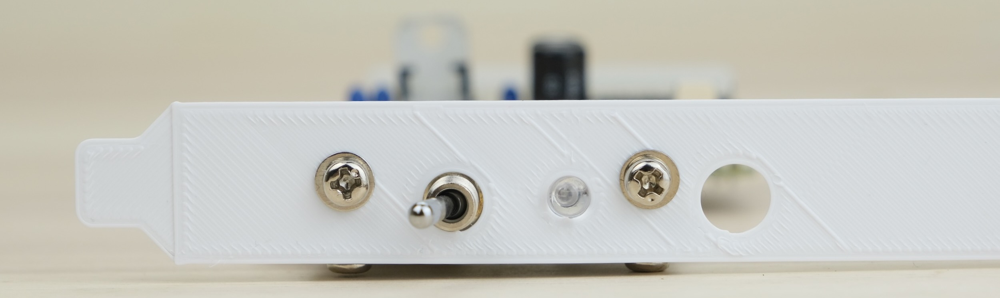

## Pre-flight Checks

Install two 5A fuses.

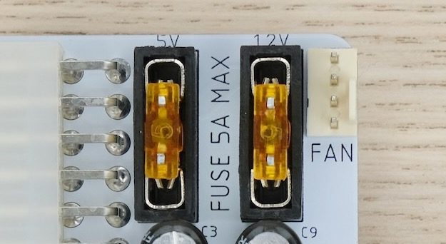

Use a multimeter to **check for dead shorts** between each power rail and GND:

If all good, plug in PicoPSU, connect power, and flip the switch.

Down is off, up is on.

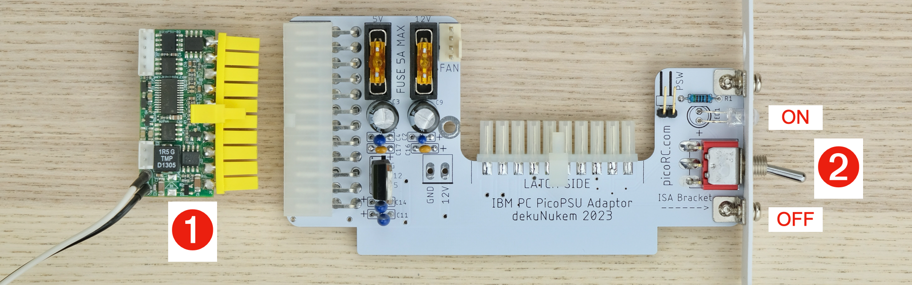

The LED should light up. The LED is wired to the `POWER_GOOD` signal, so there might be a slight delay.

Measure the voltage of power rails, make sure they are correct. 

## Installation

Undo the locking ring on the barrel jack

Insert through the hole on the bracket

Tighten the ring from the other side. Use 10mm socket.

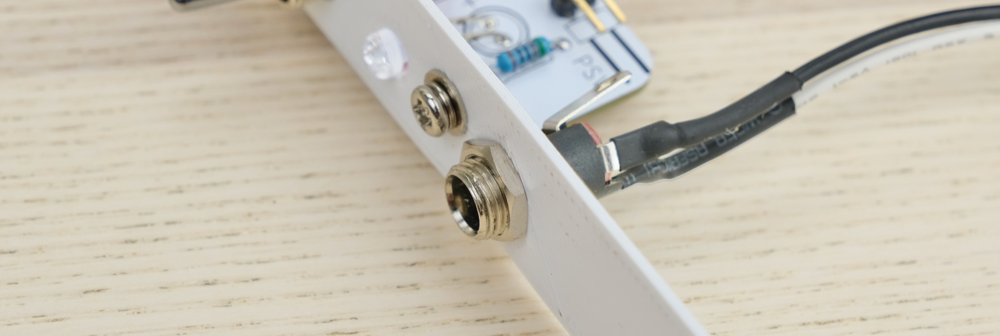

Plug in the harness that came with the PicoPSU. (1)

Plug in the ATX-to-AT cable, make sure the latch match. (2)

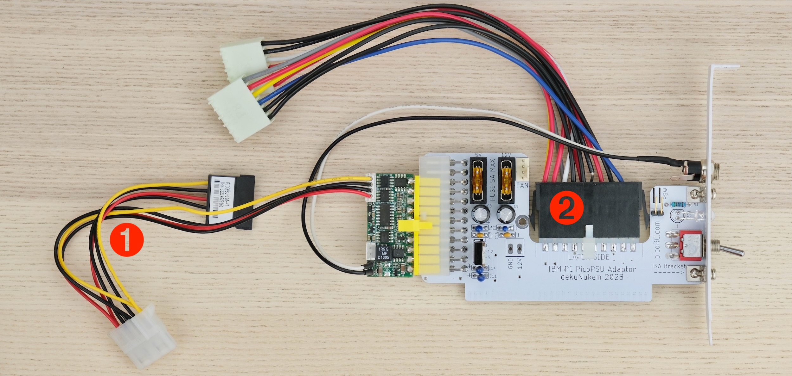

Now we're ready to install!

I'll be using an IBM 5160 PC XT as an example.

**⚠️⚠️ IMPORTANT ⚠️⚠️**

Insert the blanking plug into the power socket.

This prevents the old faulty/unknown PSU from being accidentally energized.

Undo the screws in the back, and slide the cover forward to remove.

Insert the card into a free ISA slot, secure with screw.

Connect the AT power connector, make sure **BLACK TOUCHES BLACK**.

That's pretty much it!

Plug in and flip the switch!

## But I want to use the Big Red Switch™!

## Questions or Comments?

Feel free to ask in official [Discord Chatroom](https://discord.gg/T9uuFudg7j), raise a [Github issue](https://github.com/dekuNukem/PicoRC/issues), or email `dekunukem` `gmail.com`!
