# PicoPSU Adaptor for Macintosh SE & SE/30

[Purchase Link](https://www.tindie.com/products/29184/) | [Official Discord](https://discord.gg/HAuuh3pAmB) | [Table of Contents](#table-of-contents)

----

This adaptor lets you use **Pico ATX PSU** in Macintosh SE and SE/30.

It replaces the original bulky and unreliable PSU, and uses very common 12V power brick instead.

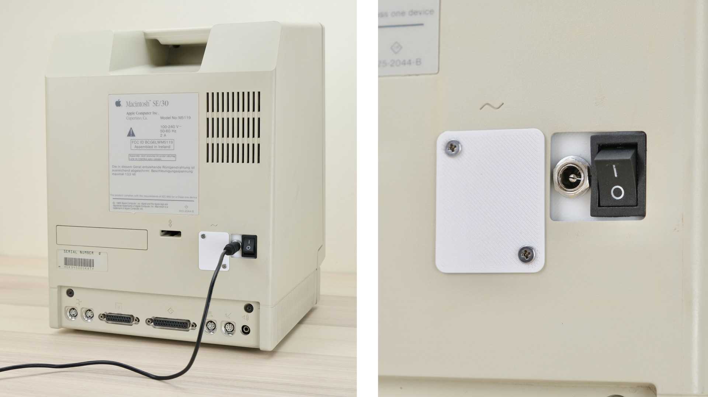

## Highlights

* **Non-destructive** and reversible

* **PC fan header** for added cooling

* **Fused** positive rails

* Low cost, efficient and reliable.

## Get One / Other Stuff

[Click me to get one!](https://www.tindie.com/products/29184/)

Also available for Mac 128K / Plus, Apple II, and more! [Check out the main page](./README.md) for details.

For more general-purpose diagnostics and retrofitting, check out the [full-fat ATX4VC](https://github.com/dekuNukem/ATX4VC)!

## Table of Contents

- [Highlights](#highlights)

- [Get One / Other Stuff](#get-one---other-stuff)

- [Getting a Pico PSU](#getting-a-pico-psu)

- [Kit Assembly](#kit-assembly)

- [Board Features](#board-features)

- [Pre-flight Checks](#pre-flight-checks)

- [Installation](#installation)

- [Troubleshooting](#troubleshooting)

- [Questions or Comments?](#questions-or-comments)

## Getting a Pico PSU

PicoPSU are tiny ATX power supplies for small PCs, but are perfect for retro computers as well.

* [Official website](https://www.mini-box.com/DC-DC) and [distributors](https://www.mini-box.com/site/resellers.html). Even the cheapest 80W one should be plenty.

* You can also find generic ones on eBay/Amazon/Aliexpress by searching `Pico ATX`. They are *not that* cheap, so I strongly suggest supporting the high-quality official products.

* A power brick with **12V DC** and **center positive** 5.5x2.5mm barrel jack is needed.

* They are very popular and you might already have one. Make sure it has enough wattage.

Remember that this solution is **only as good as your PicoPSU and 12V Brick**, so don't skimp on them!

## Kit Assembly

### Required tools

* Soldering Iron

* Solder

* Flux

* Multimeter

### Parts

Observe the parts:

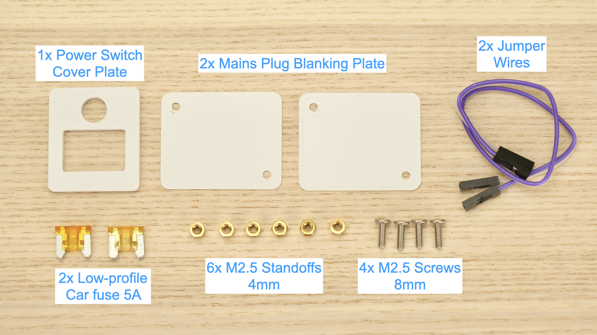

### Soldering Notes

Nothing too tricky in this kit, all basic through-hole stuff.

If this is your first time, a few tips:

* Make sure your soldering iron has **proper temperature control**, NOT the cheap ones with just a power switch! They get way too hot and will damage the PCB.

* Use **leaded solder**, much easier to work with.

* Set the temperature around 320C / 600F

* Use plenty of flux, makes everything much easier. You can clean it off afterwards.

* [This video](https://www.youtube.com/watch?v=AqvHogekDI4) covers the basics pretty well, you can also watch others by searching `how to solder`.

* Try your local makerspace or university lab too!

### Assembly

Observe the following assembly notes and reference photos.

The **black 5x2 power connector** is installed on the **bottom side**, make sure the **notch faces the edge**!

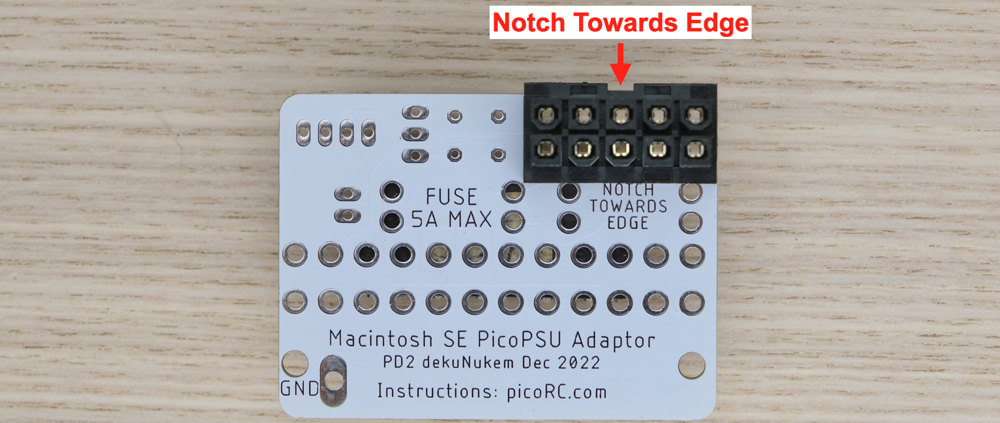

Everything else is on top side:

Start from shortest component to tallest. Insert component, hold in place with masking tape or sticky putty.

Flip it over and solder **a single pin** first, then make sure the part is **straight in all directions**.

If not, you can adjust it while melting that single pin. Once happy, solder the rest of the pins.

Make sure the solder melts properly and wets both the pin and pad to prevent cold solder joints, especially on thicker power pins.

----

Push the power switch into the plate until it clicks in place.

Make sure the **hole is on top** and **legs faces down**.

Insert into power switch PCB, make sure it sits flat and level.

Then solder it and the right-angle pin header in place.

### Cleaning

This is optional, but I like to clean off the flux with 90%+ isopropyl alcohol. Submerge and scrub with a toothbrush.

Make sure it is **completely dry** before proceeding.

### Inspection

* Compare with the reference photo and notes above. Make sure everything is in correct orientation.

* Solder joints should be **shiny and smooth**. If you see spikes, put on more flux and melt it again.

* There must be **no solder bridges**. If any, put on flux and melt it to remove.

## Board Features

If not already done, install two fuses and the jumpers as shown below:

### Power Switch

The pin header is connected to the ATX `PS_ON` pin.

Shorting them together turns on the PSU.

### PC Fan Header

* Any standard 3 or 4-pin PC fan should work

* Run it at 5V or 12V by changing the jumper

* 12V is full speed, 5V is much quieter.

### Fuse

* Use common car fuse RATED **5A OR LESS**

* Regular, Mini, and low-profile Mini all will work. Simply push into the holder.

* **DO NOT BYPASS FUSES**

### Filtering Cap (Optional)

* You can add a filtering cap to +5V and +12V rails, note the polarity if using electrolytic caps.

## Pre-flight Checks

Use a multimeter to **check for dead shorts** between each power pin and GND:

If all good, plug in Pico ATX PSU, short the two pins on the switch header, and plug in 12V power.

The PSU should turn on, **measure the voltage on each rail** and confirm they are within spec.

## Installation

We're going to take a rather large portion of the Macintosh apart, so make sure to **take plenty of photos** along the way! 

Snap a photo before removing a screw or unplugging a connector! It never hurts to have reference.

### Remove Back Cover

⚠️**Dangerous CRT voltage inside**! Make sure the computer is **unplugged for a few hours**! Or discharge the CRT yourself.

* You'll need a LONG **Torx T15 screwdriver**.

* Lay the Mac face down on a soft towel

* Loosen all the screws. Two near the ports, two in the handles.

* Take photos of which goes in where, the lower two has a thinner thread.

* Remove all the screws **apart from a single one inside the handle**.

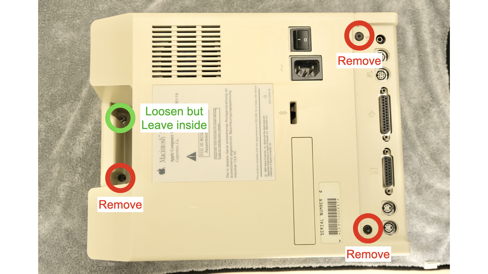

* Put the screwdriver on that single loosened screw, grab the handle and try **gently** lifting up. The back cover should pop loose.

* Slowly **lift straight up** to remove the back cover.

### Remove Old PSU

Further disassembly is needed to remove the old PSU.

* First, remove the screw for the green earth wire

* Remove the expansion bracket if present

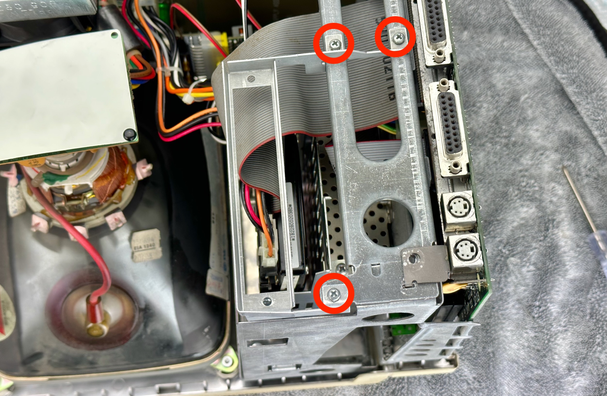

* Unplug the neck board by **gently wiggle side-to-side** while **lifting straight up**

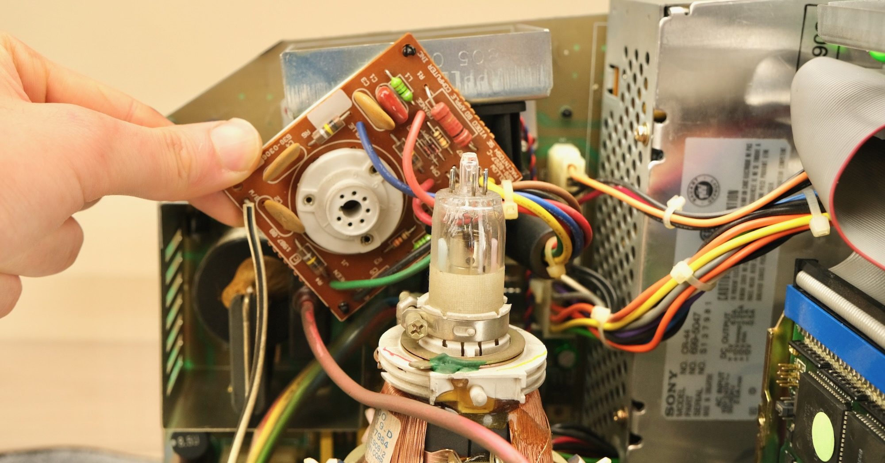

* Unplug the floppy and power cable from motherboard.

* **DO NOT YANK STRAIGHT OUT**, or you might break the CRT neck!

* Wiggle gently until loose, and carefully unplug.

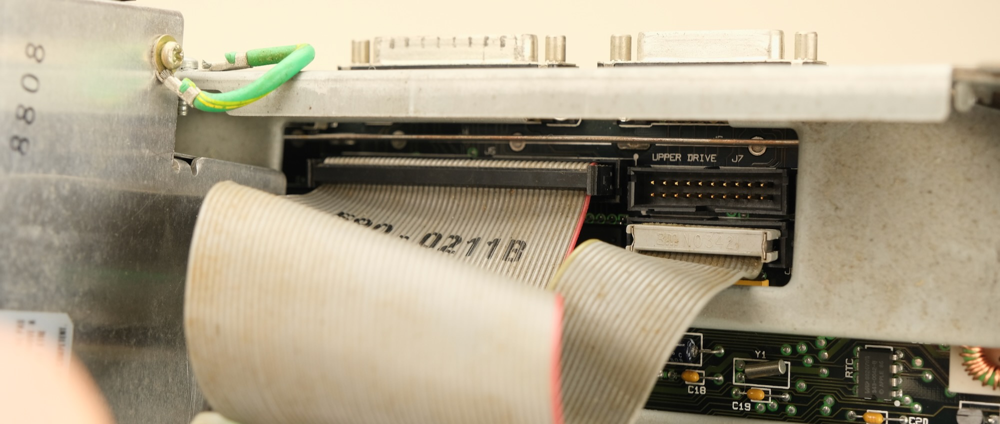

* Same with power connector, unlock the latch and gently wiggle it free. Careful with the CRT neck!

* If there's not enough space on SE/30, wait until motherboard is detached, then unplug.

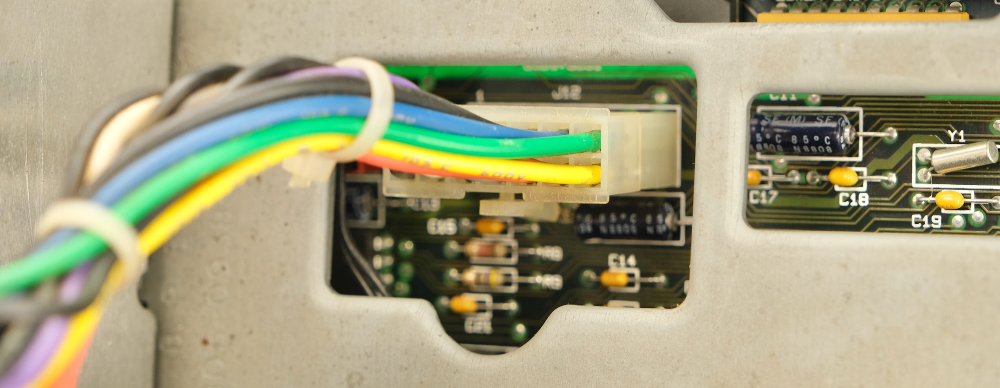

* Finally, the speaker wire, same thing.

* Now you can remove the motherboard

* [**Mac SE**] Lift straight up along the rails.

* [**SE/30**] Lift up slightly, match the notch on the PCB to the notch on the right-hand-side rail, and it should release from the side.

* With motherboard out of the way, remove the 4 screws to release the drive cage

* Careful with CRT neck while lifting it out!

* Unplug the Molex connector and 14-pin power connector

* Now we have enough room to remove the build-in PSU!

* Remove the PSU screws, support it with your hand so it doesn't fall over.

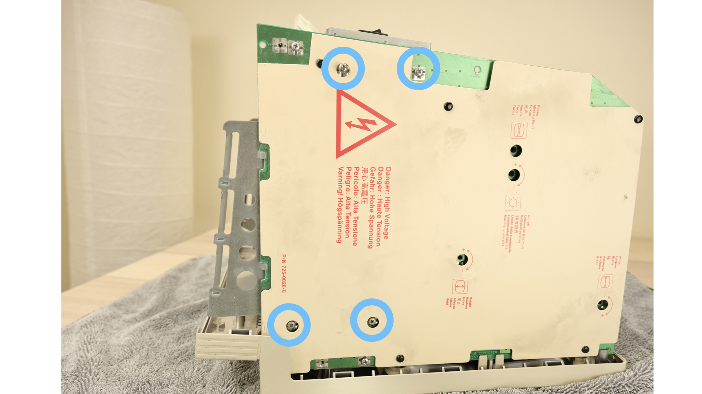

* Try rotate the PSU free, unplug, and remove. Careful not to bump into CRT glass.

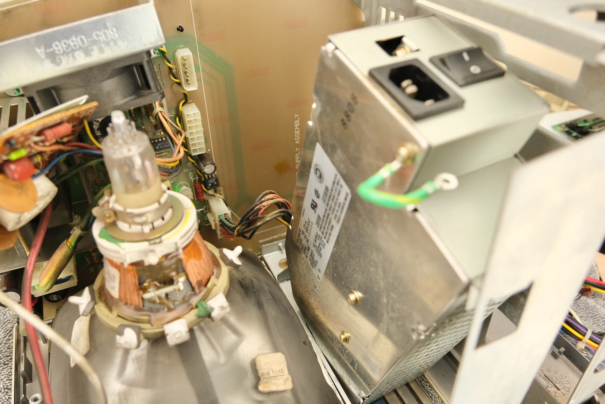

That's it! The main culprit is out!

### While You're Here...

With everything apart, it might be a good idea to perform some maintenance.

Ideas include:

* [Clean and lube the floppy drive](https://www.youtube.com/watch?v=0pGhwtyFG2I)

* Check motherboard for corrosion and cap/battery leakage

* [Re-cap the motherboard](https://www.youtube.com/watch?v=QArvemlZUJY) if not already done

* [Check analog board](https://www.youtube.com/watch?v=zC0qi5dQsWs) for cracked solder joints

* General cleaning / blow out the dust

### Install PicoPSU

With maintenance done, time to install the new PSU!

* Insert two 8mm screws into the top two PSU mounting holes, then install the standoffs to hold it in place.

* Your screwdriver set might have a bit that fits the standoff, makes it much easier.

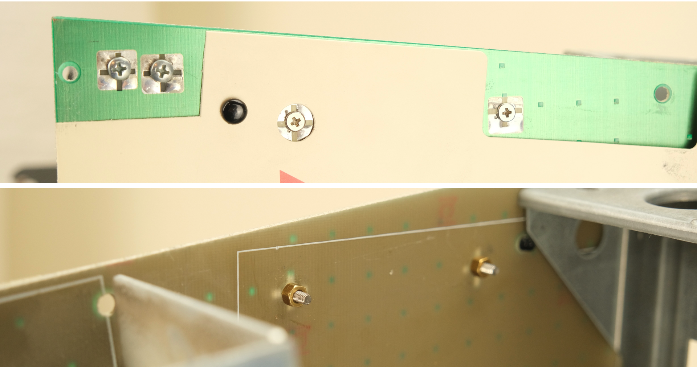

* Plug PicoPSU into ATX connector

* Use jumper cable to connect the header between two PCBs

* Undo the locking ring on the barrel jack, insert through the hole, reinstall the ring to fix it in place.

* Plug the adaptor into the analog board as shown

* Make sure connector is lined up (NOT OFF-BY-ONE), and push firmly so it's all the way in.

* Install the power switch PCB on the standoffs, and install two more standoffs to hold in place.

* That's it! You're done!

### Putting it Back Together

Time to put everything back! Pretty much the opposite of disassembly!

* **Careful with CRT neck** AT ALL TIMES!

* Plug Molex and motherboard power connector back into analog board

* Reinstall drive cage

* Reinstall motherboard

* Plug in speaker wire, power connector, SCSI and floppy cable.

* Reinstall CRT neck board

* (If present) Reinstall expansion bracket

* Double check for short circuit if you want

If everything checks out, take a breath and plug it in and switch on.

If your Mac was working before, hopefully it still does!

If the Mac is of unknown condition, now you'll find out!

And if it doesn't work, [check out the troubleshooting guide](#troubleshooting). 

### Adding a Fan

There's already a fan inside Mac SE, but you can add another one or replace it.

Any regular PC fan should work, you can run it at 12V (full speed) or 5V (quieter).

Make sure the fan is secured, nothing touches the blade, and air flow direction is correct.

**Don't mount the fan too close to the CRT**, or the picture might wobble from the motor's magnetic field.

### Blanking Plate

The plates are secured with either **screws** or **nylon rivets**.

#### Screws

* Put a blanking plate over the mains plug hole, insert two screws.

* Support the whole thing with your hand, and flip it over.

* Install the other plate from inside, and secure it with standoffs.

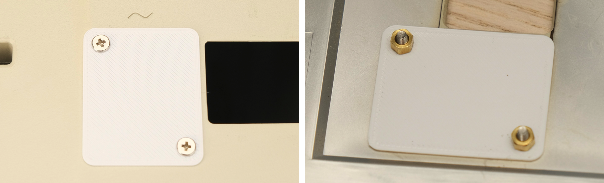

#### Nylon Rivets

* Pull the rivet apart

* Insert the "hollow tube" into a blanking plate

* Cover the mains plug hole from outside, then insert the other plate from inside

* Insert the "plunger" into the tube to fasten it together.

## Congratulations!

Put the rear shell back on (**don't forget the paper insulation over the motherboard!**), and you're done!

With the new PSU, a fresh maintenance, and upgraded cooling, your Mac should continue to provide entertainment for years to come!

## Troubleshooting

This adaptor eliminates the PSU from the equation, but that's only part of the puzzle!

If something else is wrong, you still need to fix it.

### Nothing Happens / Garbled Screen

* Look for corrosion from battery / capacitor leakage on the motherboard.

* Mac SE/30 WILL have leaking caps, and you'll need to recap before it will work.

* Check for blown fuse, or shorts on power rails.

### CRT Geometry Messed Up

I had this happen with a knock-off generic PicoPSU, changing to another one fixed it.

### Screen Wobbles

* If it happens when floppy drive is active, try using a beefier power brick, or add decoupling capacitors.

* If happens while idle, make sure the fan is not too close to the CRT.

### Other Failures

Other common issues include:

* Cracked solder joints

* Dirty contacts / Bad RAMs

I highly recommend watching [Adrian's Digital Basement Macintosh Repair-a-thon](https://www.youtube.com/watch?v=lKD65I86XGQ), where he covers a lot of those in detail.

The **power connector** and CRT **deflection capacitors** are notorious for cracking, here are some examples on mine:

It might be very difficult to see with naked eye, so use magnification!

Flux + new solder should fix it right up, if you find one crack might as well do the whole row.

## Questions or Comments?

Feel free to ask in official [Discord Chatroom](https://discord.gg/T9uuFudg7j), raise a [Github issue](https://github.com/dekuNukem/PicoRC/issues), or email `dekunukem` `gmail.com`!
