# Osborne 1 PicoRC Installation: Early Version (Side Latch)

[Purchase Link](https://www.tindie.com/products/30087/) | [Official Discord](https://discord.gg/HAuuh3pAmB) | [Main Page](osborne1.md)

## Kit Assembly

[See Main Article](osborne1.md)

## Installation

* 🚨🚨 This guide is for **EARLY MODEL (SIDE LATCH)**, [CLICK ME FOR LATE MODEL (TOP LATCH)](osborne1.md) 🚨🚨
* 🚨🚨 This guide is for **EARLY MODEL (SIDE LATCH)**, [CLICK ME FOR LATE MODEL (TOP LATCH)](osborne1.md) 🚨🚨
* 🚨🚨 This guide is for **EARLY MODEL (SIDE LATCH)**, [CLICK ME FOR LATE MODEL (TOP LATCH)](osborne1.md) 🚨🚨

Some disassembly is needed, make sure to **take plenty of photos** along the way! 

Take a photo one before removing a screw or unplugging a connector! It never hurts to have reference.

-------

I'll be using a new-to-me and untested early Osborne 1 for this guide, excuse the dust!

With Apple stickers! 😅

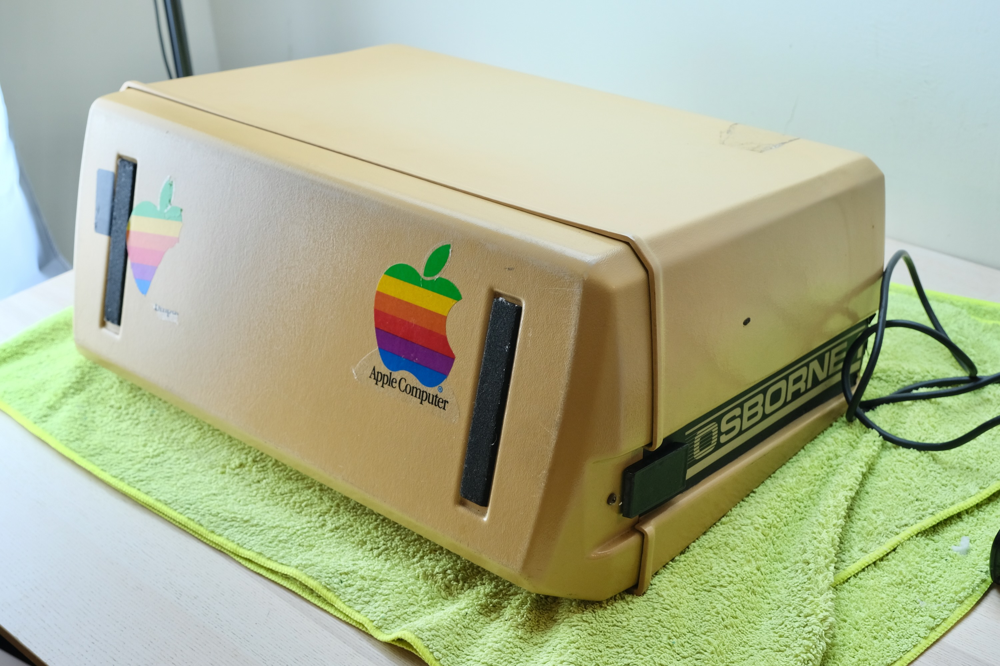

* Put it on a soft towel
* At the back, remove 6 screws on the power panel

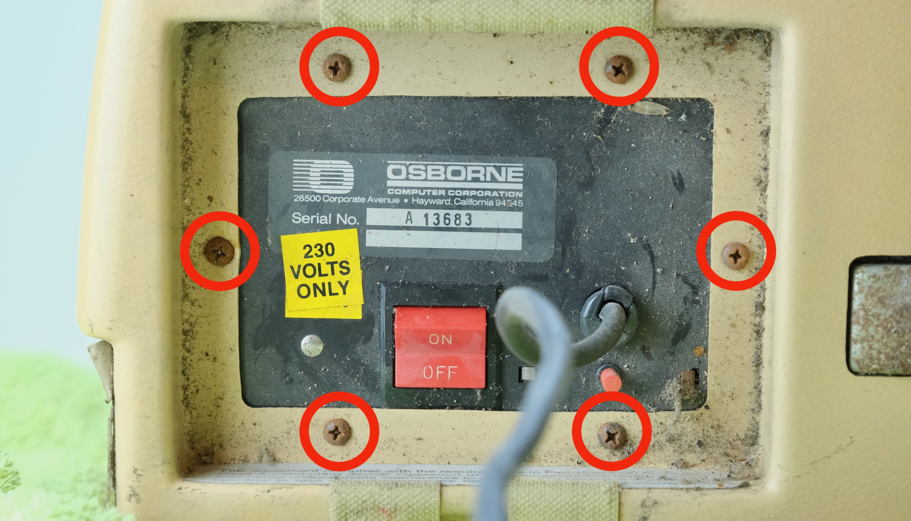

* Also two screws on the handle

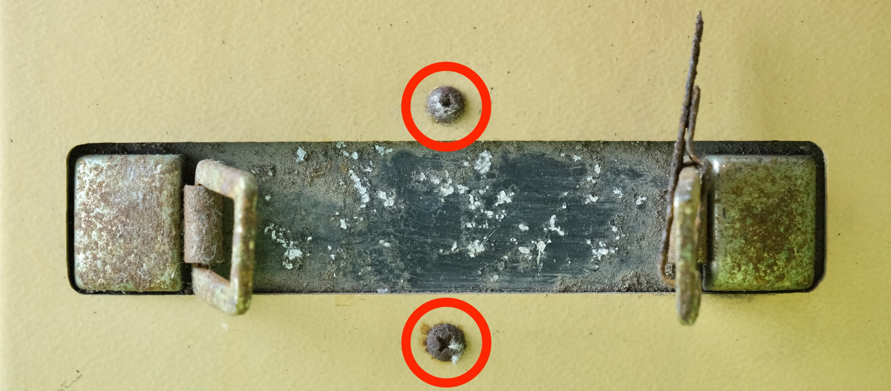

* Organise your screws! 
* At each stage, put em in a bag with labels to avoid mix-ups.

* Unlatch and unplug the keyboard.
* Remove brightness and contrast knob
	* Undo grub screw with small allen key
	* Pull off knobs

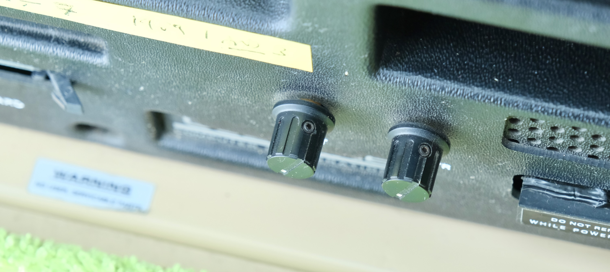

* Undo the 7 face plate screws

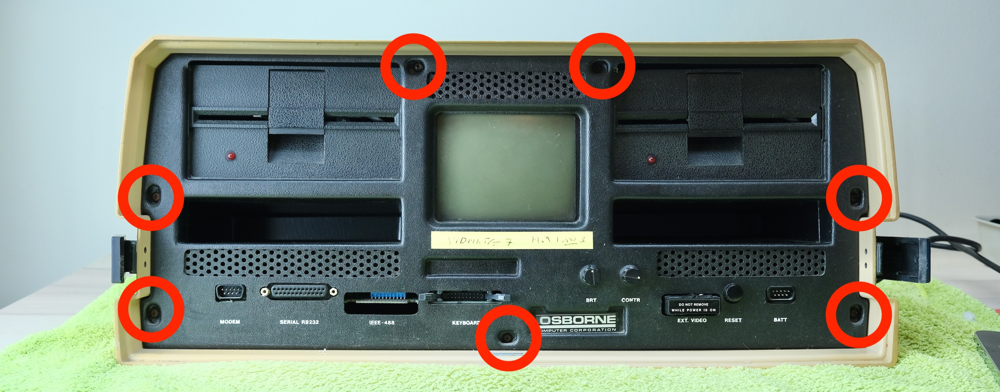

* Remove the face plate

* Remove the two side screws

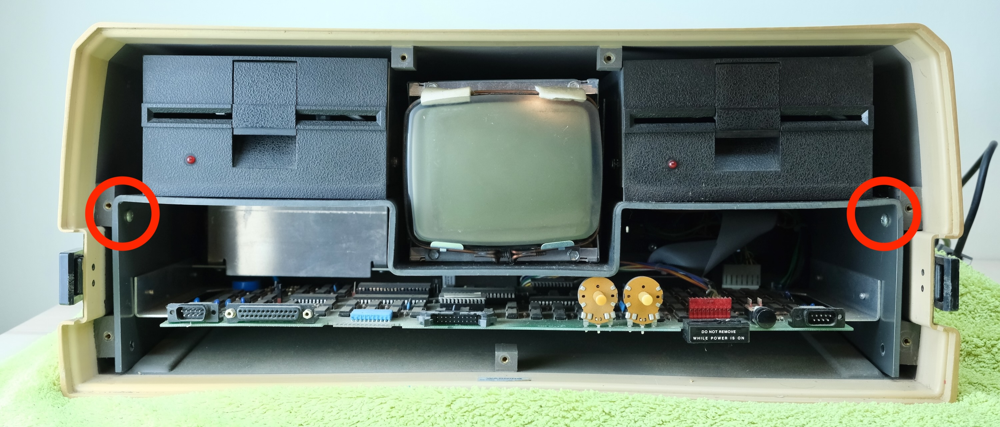

* Take out the entire innards

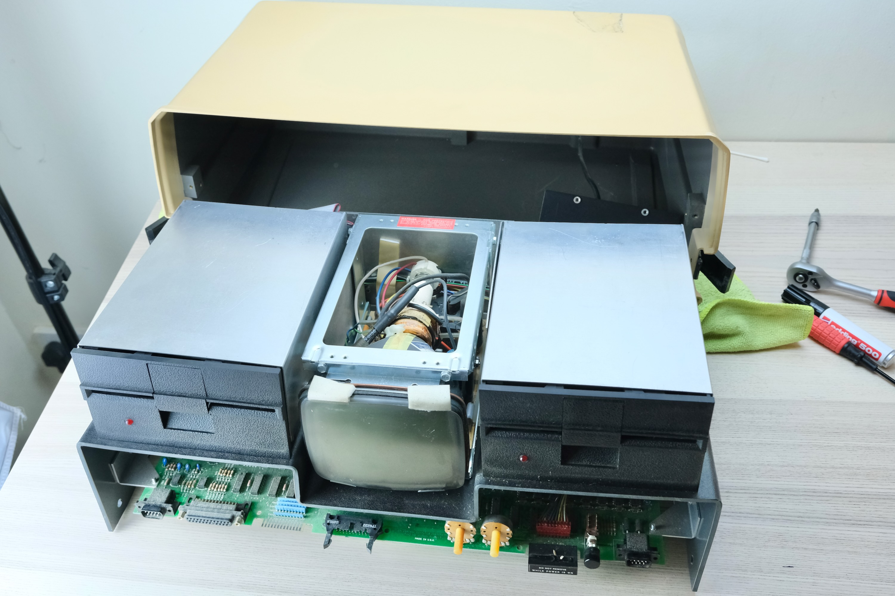

* Flip it over and remove 4 screws holding the motherboard

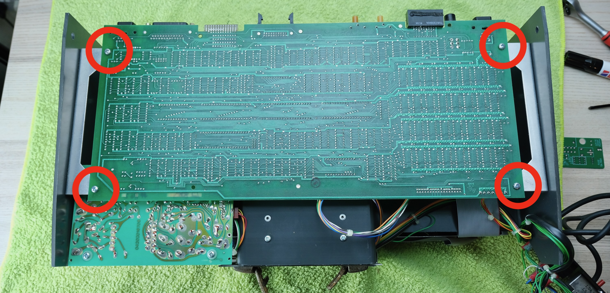

* Rest the motherboard on the table.
* **Take some photos** of all the connectors' orientation

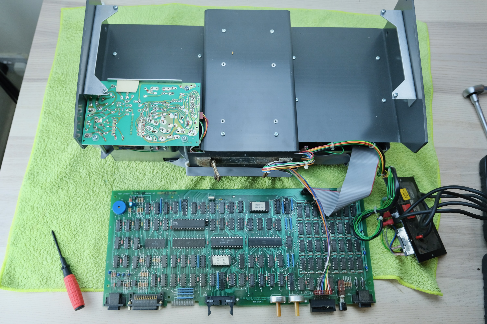

* Undo 4 screws on the old PSU

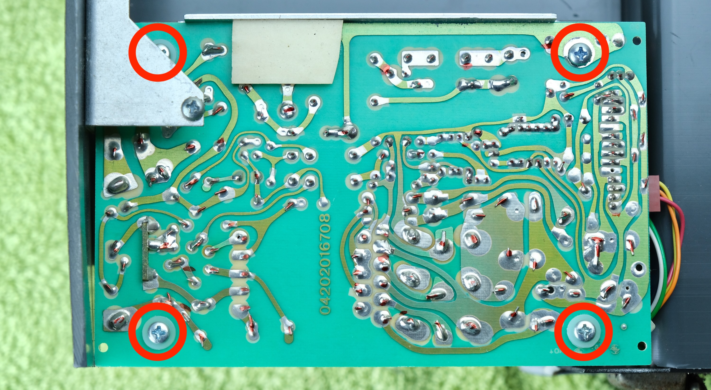

* Flip over old PSU
* Unplug connectors shown
* Put it away for safekeeping
	* **DO NOT throw anything away!**

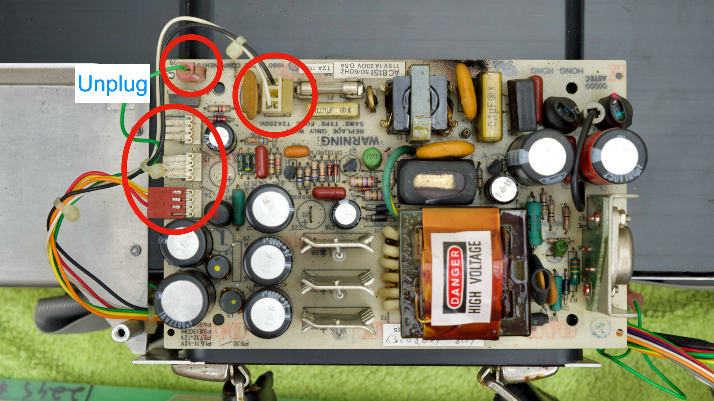

* Offer up new PCB
* Plug in AC connector
	* Black / Brown: Live
	* White / Blue: Neutral
* Plug in Earthing Lug
	* Green
* Plug in DC output connector
	* **Ensure COLOURS MATCH**

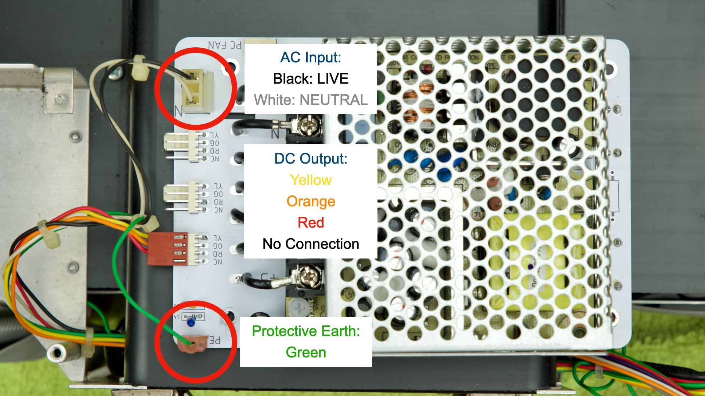

That's pretty much it! Now we can have a quick test

* Rest PSU on **insulator**
	* Cardboard, plastic, etc.
* Ensure power switch is OFF
* Plug in cable
* **DON'T TOUCH ANYTHING ELSE**
* Flip switch ON

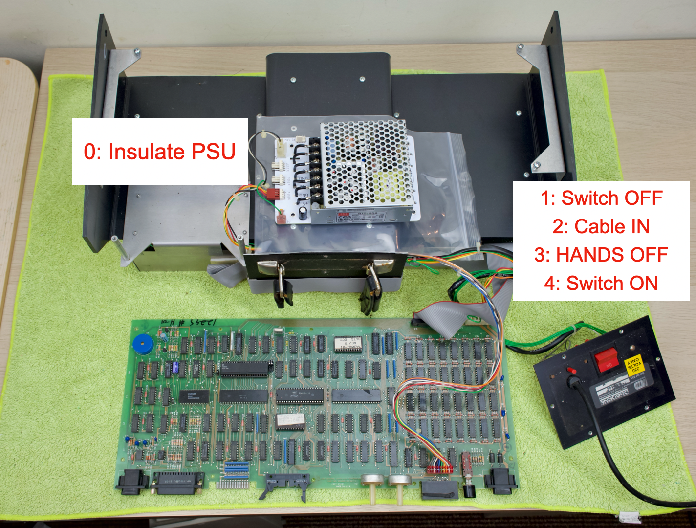

Several things may happen:

* It beeps and just works
	* Possible but rare
* It beeps but garbled screen
	* Usually bad RAM
* Nothing happens
	* Measure voltage at fuse holder
	* Stable voltage
		* Turn up brightness / contrast
		* Still nothing? Fault on MB (likely RAM) / CRT board.
	* No voltage / Voltage jumping around
		* Dead short somewhere, PSU in protection mode.
		* Most likely tantalum cap on +12V / -12V
* **⚠️TURN OFF AND UNPLUG⚠️** before start working on the computer!

Even if works, might as well do a little maintenance while you're in there!

* Clean / lube floppy
* Blow out dust
* Inspect CRT board for cold solder joints, etc

Once happy, re-install the new PSU.

* Secure the **insulation sheet** with the rightmost screws

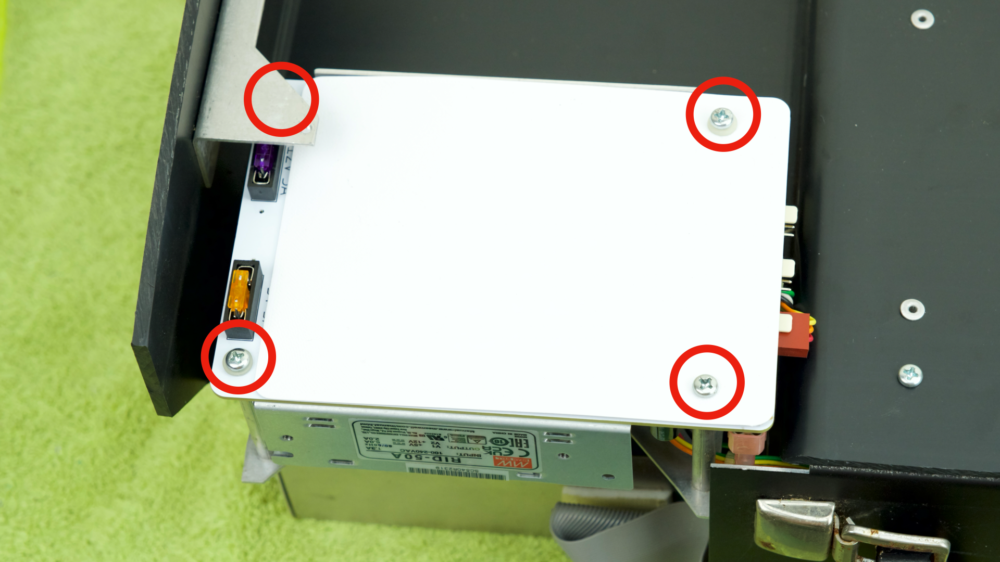

### Reassemble

* Follow the instructions in reverse to reassemble

## Congratulations!

Hopefully with the new PSU and maintenance, your Osborne 1 is now fully functional, enjoy!

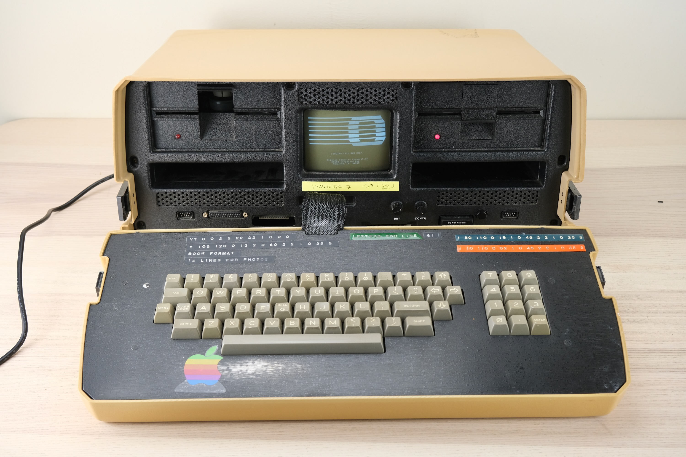

## Questions or Comments?

Feel free to ask in official [Discord Chatroom](https://discord.gg/T9uuFudg7j), raise a [Github issue](https://github.com/dekuNukem/PicoRC/issues), or email `dekunukem` `gmail.com`!
